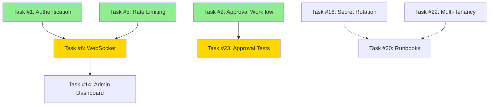

# Sprint Planner Skill

**Purpose:** Guide systematic sprint planning with task analysis, effort estimation, dependency mapping, and workload balancing for optimal team productivity.

**Category:** Project Management
**Complexity:** High
**Frequency:** Every sprint (1-2 weeks), major releases, team delegation
**Prerequisites:** TASK_LIST.md or similar task inventory, team size known
**Estimated Time:** 45-90 minutes for comprehensive sprint plan

---

## When to Use This Skill

Use this skill when you need to:
- ✅ **Start a new sprint** (every 1-2 weeks)
- ✅ **Plan major features or releases** (quarterly planning)
- ✅ **Delegate work** across multiple developers or AI agents
- ✅ **Balance workload** across team members
- ✅ **Identify bottlenecks** and critical path issues
- ✅ **Set sprint goals** with measurable success criteria
- ✅ **Analyze dependencies** to prevent blocking
- ✅ **Estimate capacity** and prevent over-commitment

**Do NOT use this skill for:**
- ❌ Single-task execution (use /tdd-helper instead)
- ❌ Daily task tracking (use project management tools)
- ❌ Long-term roadmap planning (months/years)

---

## Overview

This skill provides a **systematic 7-phase process** for sprint planning:

```
Phase 1: Task Discovery & Inventory
   ↓
Phase 2: Effort Estimation & Complexity Analysis
   ↓
Phase 3: Dependency Mapping & Critical Path
   ↓
Phase 4: Domain Grouping & Theme Identification
   ↓
Phase 5: Workload Balancing & Team Assignment
   ↓
Phase 6: Sprint Goals & Success Metrics
   ↓
Phase 7: Risk Analysis & Mitigation
   ↓
Output: Comprehensive Sprint Plan
```

**Expected Outcomes:**
- Balanced task assignments across N team members
- Clear sprint goals with measurable success criteria
- Dependency graph showing execution order
- Risk analysis with mitigation strategies
- Daily/weekly milestones and checkpoints

---

## Phase 1: Task Discovery & Inventory

### Objective
Identify all tasks for the upcoming sprint and document current project state.

### Steps

**Step 1.1: Locate Task Inventory**
```bash
# Check for existing task list
ls -la TASK_LIST.md

# If exists, read it
cat TASK_LIST.md

# If not, create one from other sources:
# - GitHub issues
# - Project backlog
# - Feature requests
# - Bug reports
# - Technical debt
```

**Step 1.2: Document Current State**

Gather project metrics:
```bash
# Test count
dotnet test --verbosity quiet | grep -E "Passed|Failed|Skipped"

# Build status
dotnet build --no-incremental 2>&1 | grep -E "Warning|Error|succeeded"

# Code metrics (optional)
find src -name "*.cs" | wc -l  # Line count
git log --since="1 month ago" --oneline | wc -l  # Recent commits
```

**Step 1.3: Categorize Tasks**

Group tasks by:
- **Status:** Not Started, In Progress, Blocked, Completed
- **Priority:** Critical (🔴), High (🟡), Medium (🟢), Low (⚪)
- **Type:** Feature, Bug Fix, Refactor, Documentation, Infrastructure

**Template:**
```markdown
## Task Inventory (Sprint [Number])

**Total Tasks:** X
- Not Started: Y
- In Progress: Z
- Blocked: W

**By Priority:**
- Critical (🔴): A tasks
- High (🟡): B tasks
- Medium (🟢): C tasks
- Low (⚪): D tasks

**By Type:**
- Features: E tasks
- Bug Fixes: F tasks
- Refactoring: G tasks
- Documentation: H tasks
- Infrastructure: I tasks
```

---

## Phase 2: Effort Estimation & Complexity Analysis

### Objective
Estimate effort for each task and identify complexity factors.

### Effort Estimation Framework

**T-Shirt Sizing:**
- **XS:** < 0.5 days (trivial, well-understood, no dependencies)
- **S:** 0.5-1 day (simple, clear requirements, minimal unknowns)
- **M:** 1-3 days (moderate complexity, some unknowns, standard patterns)
- **L:** 3-5 days (complex, multiple components, integration required)
- **XL:** 5-10 days (very complex, research required, high uncertainty)
- **XXL:** > 10 days (epic, should be broken down)

**Fibonacci Points (Alternative):**
- 1 point = 0.5 days
- 2 points = 1 day
- 3 points = 1.5 days
- 5 points = 2.5 days
- 8 points = 4 days
- 13 points = 6.5 days

### Complexity Factors

Consider these when estimating:

1. **Technical Complexity**
   - New technology/framework? (+50% effort)
   - Complex algorithms? (+30% effort)
   - Performance-critical? (+25% effort)

2. **Integration Complexity**
   - External API integration? (+40% effort)
   - Multiple system touch points? (+35% effort)
   - Database schema changes? (+30% effort)

3. **Testing Complexity**
   - Requires integration tests? (+25% effort)
   - Requires load/performance tests? (+50% effort)
   - Hard to mock/test? (+30% effort)

4. **Uncertainty Factor**
   - Well-defined requirements? (baseline)
   - Some unknowns? (+25% effort)
   - High uncertainty? (+50% effort)
   - Research spike needed? (+100% effort)

### Estimation Template

For each task, document:
```markdown
### Task #X: [Task Name]
**T-Shirt Size:** M (1-3 days)
**Base Effort:** 2 days
**Complexity Factors:**
- New SignalR technology: +50% (+1 day)
- Integration testing required: +25% (+0.5 days)
**Adjusted Effort:** 3.5 days
**Confidence:** Medium (±1 day)
```

### Validation Questions

Ask these to validate estimates:
- ✅ Have we done something similar before?
- ✅ Are requirements clear and complete?
- ✅ Are all dependencies identified?
- ✅ Is testing approach defined?
- ✅ Are success criteria measurable?

If "No" to any → increase uncertainty buffer (+25-50%)

---

## Phase 3: Dependency Mapping & Critical Path

### Objective
Identify task dependencies and determine optimal execution order.

### Dependency Types

**1. Hard Dependencies (Blocking)**
- Task B cannot start until Task A is complete
- Example: API endpoints (A) must exist before SDK (B) can be built

**2. Soft Dependencies (Helpful)**
- Task B is easier if Task A is done first, but not required
- Example: Documentation (B) benefits from implementation (A) being complete

**3. Resource Dependencies**
- Tasks requiring the same person/skill
- Tasks modifying the same codebase area

**4. Data Dependencies**
- Task B needs output/data from Task A
- Example: Load tests (B) need performance baseline from metrics (A)

### Creating Dependency Graph

**Step 3.1: Identify Dependencies**

For each task, ask:
- What must be complete BEFORE this task starts?
- What tasks are BLOCKED by this task?
- What tasks share the same code/resources?

**Step 3.2: Document Dependencies**

```markdown
### Task #6: WebSocket Real-Time Updates
**Depends On:**
- Task #1: Authentication (needs JWT tokens for WebSocket auth)
- Task #5: Rate Limiting (should apply to WebSocket connections)

**Blocks:**
- Task #14: Admin Dashboard UI (dashboard uses WebSocket for live updates)

**Resource Conflicts:**
- Task #8: Helm Charts (both modify Program.cs for service registration)
```

**Step 3.3: Create Dependency Diagram (Mermaid)**



Legend:
- Green = Completed (no longer blocking)
- Yellow = In Progress or Planned
- Solid line = Hard dependency (blocking)
- Dotted line = Soft dependency (helpful)

**Step 3.4: Calculate Critical Path**

Critical path = longest sequence of dependent tasks

Example:
```
Critical Path: Task #1 → Task #6 → Task #14
Total Duration: 0 days (done) + 3 days + 10 days = 13 days
```

If critical path > sprint duration → reduce scope or parallelize

### Execution Order Strategies

**Strategy 1: Breadth-First (Parallel)**
- Start all independent tasks simultaneously
- Good for: Large teams, no resource conflicts
- Risk: Integration complexity at the end

**Strategy 2: Depth-First (Sequential)**
- Complete one dependency chain at a time
- Good for: Small teams, high-risk tasks
- Risk: Slower overall progress

**Strategy 3: Critical Path First**
- Prioritize tasks on the critical path
- Good for: Time-constrained sprints
- Risk: Non-critical tasks may slip

**Recommendation:** Hybrid approach
1. Start critical path tasks first
2. Fill gaps with independent tasks
3. Leave integration tasks for the end

---

## Phase 4: Domain Grouping & Theme Identification

### Objective
Group related tasks by domain expertise for efficient assignment.

### Domain Categories

**1. Security & Authentication**
- Authentication systems (JWT, OAuth, SSO)
- Authorization and RBAC
- Secret management and rotation
- Security scanning and audits
- Cryptography and encryption

**2. Testing & Quality Assurance**
- Unit test development
- Integration test infrastructure
- Performance/load testing
- Test coverage analysis
- Bug fixing and regression testing

**3. Platform & Infrastructure**
- Kubernetes deployment (Helm, manifests)
- Service discovery (Consul, etcd)
- Monitoring and observability
- CI/CD pipelines
- Docker and containerization

**4. Features & User Experience**
- Real-time communication (WebSocket, SignalR)
- API endpoints and REST design
- Client SDKs
- Admin dashboards and UIs
- Data models and business logic

**5. Operations & Documentation**
- Runbooks and incident response
- Architecture Decision Records (ADRs)
- API documentation
- Deployment guides
- Troubleshooting guides

### Grouping Tasks

**Step 4.1: Assign Primary Domain**

For each task, identify the primary domain:
```markdown
### Task #16: Secret Rotation System
**Primary Domain:** Security & Authentication
**Secondary Domains:** Platform & Infrastructure (Azure Key Vault integration)
**Skills Required:** Azure services, .NET security, cryptography
```

**Step 4.2: Identify Cross-Domain Tasks**

Flag tasks that span multiple domains:
```markdown
### Task #6: WebSocket Real-Time Updates
**Primary Domain:** Features & User Experience
**Secondary Domains:**
- Platform & Infrastructure (SignalR configuration)
- Security & Authentication (WebSocket auth)
**Cross-Domain Collaboration:** Yes (requires security review)
```

**Step 4.3: Group by Theme**

Create thematic clusters:
```markdown
## Sprint Theme: Production Readiness

**Security Hardening (3 tasks, 8 days):**
- Task #16: Secret Rotation
- Task #17: OWASP Security Review (completed)
- Task #22: Multi-Tenancy

**Test Coverage Improvement (3 tasks, 6 days):**
- Task #23: Fix Approval Test Hang
- Task #24: Optimize Deployment Tests
- Task #10: Load Testing Suite

**Cloud-Native Platform (3 tasks, 7 days):**
- Task #6: WebSocket Real-Time Updates
- Task #8: Helm Charts for Kubernetes
- Task #9: Service Discovery
```

---

## Phase 5: Workload Balancing & Team Assignment

### Objective
Distribute tasks evenly across team members based on capacity, skills, and dependencies.

### Team Capacity Planning

**Step 5.1: Calculate Available Capacity**

For each team member:
```
Available Days = Sprint Duration - (Meetings + Admin + Overhead)

Example (2-week sprint):
- Calendar days: 10 working days
- Daily standup: -0.5 days (30 min/day)
- Sprint planning: -0.5 days
- Sprint review/retro: -0.5 days
- Admin/email: -0.5 days
- Buffer for interruptions: -1 day
= Net available: 7 days per person
```

**Step 5.2: Assess Team Skills**

Map team members to domains:
```markdown
## Team Skill Matrix

| Team Member | Security | Testing | Platform | Features | Operations |
|-------------|----------|---------|----------|----------|------------|
| Developer 1 | ★★★ | ★★ | ★★★ | ★★ | ★★ |
| Developer 2 | ★★ | ★★★ | ★★ | ★★★ | ★★ |
| Developer 3 | ★ | ★★ | ★★★ | ★★ | ★★★ |

Legend: ★★★ Expert, ★★ Proficient, ★ Learning
```

### Assignment Algorithm

**Step 5.3: Balance Workload**

1. **Assign Critical Path Tasks First**
   - Assign to most experienced person in domain
   - Ensure no single person blocks progress

2. **Balance by Effort**
   - Target: Equal effort per person (±10%)
   - Avoid overloading any single person

3. **Balance by Complexity**
   - Mix easy and hard tasks per person
   - Prevent burnout from all-hard assignments

4. **Respect Dependencies**
   - Same person for dependent tasks (reduces handoff)
   - Or ensure clear handoff points

**Example Assignment:**

```markdown
## Sprint Assignments

### Developer 1: Security Focus (7.5 days)
1. Task #16: Secret Rotation (3 days)
2. Task #22: Multi-Tenancy API (4 days)
3. Task #21: Fix Rollback Tests (0.5 days) - Quick win

**Rationale:** Expert in security, tasks are related (tenant isolation + secrets)

### Developer 2: Testing Focus (7 days)
1. Task #23: Fix Approval Test Hang (2 days)
2. Task #24: Optimize Deployment Tests (3 days)
3. Task #10: Load Testing Suite (2 days)

**Rationale:** Testing expert, tasks are sequential (fix tests → optimize → load test)

### Developer 3: Platform Focus (7.5 days)
1. Task #6: WebSocket Real-Time Updates (3 days)
2. Task #8: Helm Charts for Kubernetes (2 days)
3. Task #9: Service Discovery (2.5 days)

**Rationale:** Platform/DevOps expert, tasks enable production deployment
```

**Workload Balance Check:**
- Developer 1: 7.5 days (107% capacity) - acceptable
- Developer 2: 7.0 days (100% capacity) - perfect
- Developer 3: 7.5 days (107% capacity) - acceptable
- **Variance:** 7% (excellent balance)

### Handling Imbalance

If workload variance > 20%:
- **Over-allocated person:** Move lowest-priority task to under-allocated person
- **Under-allocated person:** Add stretch goals or help with reviews
- **Skill mismatch:** Pair programming or knowledge transfer

---

## Phase 6: Sprint Goals & Success Metrics

### Objective
Define clear, measurable sprint goals aligned with project objectives.

### SMART Goal Framework

Goals should be:
- **S**pecific - Clear and unambiguous
- **M**easurable - Quantifiable outcomes
- **A**chievable - Realistic given capacity
- **R**elevant - Aligned with project vision
- **T**ime-bound - Completed within sprint

### Sprint Goal Template

```markdown
## Sprint [Number] Goals

**Sprint Theme:** [Theme Name]
**Duration:** [Start Date] to [End Date] (X weeks)
**Team Size:** N developers

### Primary Goals (Must-Have)

1. **[Goal 1 Name]**
   - **Objective:** [What we're achieving]
   - **Success Criteria:**
     - [ ] Metric 1: [Specific target]
     - [ ] Metric 2: [Specific target]
   - **Tasks:** Task #A, Task #B
   - **Owner:** Developer X
   - **Risk:** [Risk level: Low/Medium/High]

2. **[Goal 2 Name]**
   - ...

### Secondary Goals (Nice-to-Have)

1. **[Goal 3 Name]**
   - ...

### Stretch Goals (If Time Permits)

1. **[Goal 4 Name]**
   - ...
```

### Example Sprint Goals

```markdown
## Sprint 3 Goals: Production Readiness

**Duration:** 2025-11-20 to 2025-12-03 (2 weeks)
**Team Size:** 3 developers

### Primary Goals (Must-Have)

1. **Security Hardening**
   - **Objective:** Implement production-grade security features
   - **Success Criteria:**
     - [x] Secret rotation automated with Azure Key Vault
     - [x] Multi-tenancy API endpoints functional (7 endpoints)
     - [x] Zero high-severity security vulnerabilities
   - **Tasks:** Task #16, Task #22
   - **Owner:** Developer 1
   - **Risk:** Medium (Azure Key Vault integration complexity)

2. **Test Coverage Improvement**
   - **Objective:** Fix skipped integration tests and establish performance baselines
   - **Success Criteria:**
     - [x] Integration tests: 24/69 → 47/69 passing (+96% improvement)
     - [x] Integration test execution time: <5 minutes
     - [x] Load test suite operational (4 scenarios documented)
   - **Tasks:** Task #23, Task #24, Task #10
   - **Owner:** Developer 2
   - **Risk:** High (test hang root cause unknown)

3. **Cloud-Native Platform**
   - **Objective:** Enable production Kubernetes deployment
   - **Success Criteria:**
     - [x] WebSocket real-time updates working (100+ concurrent connections)
     - [x] Helm chart deploys to K8s 1.28+
     - [x] Service discovery integrated with Consul
   - **Tasks:** Task #6, Task #8, Task #9
   - **Owner:** Developer 3
   - **Risk:** Low (well-understood technologies)

### Secondary Goals (Nice-to-Have)

1. **Operations Documentation**
   - **Objective:** Create runbooks for production operations
   - **Success Criteria:**
     - [x] Incident response runbook complete
     - [x] Rollback procedures documented
     - [x] Troubleshooting guide covers 90%+ common issues
   - **Tasks:** Task #20
   - **Owner:** Developer 1 (if time permits after primary goals)
   - **Risk:** Low (documentation task)

### Stretch Goals (If Time Permits)

1. **TypeScript SDK**
   - **Objective:** Improve developer experience for 3rd party integration
   - **Success Criteria:**
     - [x] SDK published to npm
     - [x] 20+ unit tests with >80% coverage
   - **Tasks:** Task #18 (partial - basic implementation)
   - **Owner:** Developer 2 (if tests complete early)
   - **Risk:** Medium (new codebase)
```

### Success Metrics

Track these throughout the sprint:

**Velocity Metrics:**
- Tasks completed vs planned
- Story points delivered vs committed
- Actual effort vs estimated effort

**Quality Metrics:**
- Test coverage maintained (target: 85%+)
- Build failures (target: 0)
- Code review turnaround time (target: <24 hours)

**Delivery Metrics:**
- Features deployed to production
- Bugs fixed vs introduced
- Technical debt added vs reduced

---

## Phase 7: Risk Analysis & Mitigation

### Objective
Identify risks that could derail the sprint and plan mitigation strategies.

### Risk Categories

**1. Technical Risks**
- New technology/framework
- Complex integration
- Performance uncertainty
- Infrastructure dependencies

**2. Resource Risks**
- Team member unavailability
- Skill gaps
- Competing priorities
- External dependencies

**3. Scope Risks**
- Unclear requirements
- Scope creep
- Underestimated effort
- Changing priorities

**4. Dependency Risks**
- Blocked by other teams
- Third-party API changes
- Infrastructure not ready
- Data not available

### Risk Assessment Matrix

**Impact:**
- **High:** Sprint fails or major goal missed
- **Medium:** Goal delayed or quality compromised
- **Low:** Minor inconvenience

**Probability:**
- **High:** >50% chance of occurring
- **Medium:** 25-50% chance
- **Low:** <25% chance

**Priority:** Impact × Probability

```
       │ Low Impact │ Medium Impact │ High Impact
───────┼────────────┼───────────────┼─────────────
High P │   Medium   │     High      │  Critical
Medium │    Low     │    Medium     │    High
Low    │    Low     │      Low      │   Medium
```

### Risk Analysis Template

```markdown
## Sprint Risks

### Critical Risks (High Impact + High Probability)

**Risk #1: ApprovalWorkflow Test Hang Root Cause Unknown**
- **Category:** Technical
- **Impact:** High (blocks 7 integration tests, affects Task #23)
- **Probability:** High (unknown complexity)
- **Mitigation:**
  1. Time-box investigation to 1 day
  2. If not resolved, skip test and document issue
  3. Escalate to team lead for pairing
- **Contingency:** Proceed with Task #24 while debugging
- **Owner:** Developer 2

### High Risks (High Impact OR High Probability)

**Risk #2: Azure Key Vault Integration Complexity**
- **Category:** Technical
- **Impact:** High (Task #16 is critical security feature)
- **Probability:** Medium (team has limited Azure experience)
- **Mitigation:**
  1. Review Azure Key Vault documentation (1 hour)
  2. Create proof-of-concept in separate branch (2 hours)
  3. Use managed identity for authentication (no secrets)
- **Contingency:** Fall back to HashiCorp Vault if Azure blocked
- **Owner:** Developer 1

**Risk #3: Developer 1 Vacation Days**
- **Category:** Resource
- **Impact:** High (7.5 days of work assigned)
- **Probability:** Medium (personal leave possible)
- **Mitigation:**
  1. Confirm availability at sprint start
  2. Move Task #21 (0.5 day quick win) to Developer 2 if needed
  3. Pair Developer 3 on Task #22 to enable coverage
- **Contingency:** Reduce scope to Task #16 only (critical)
- **Owner:** Scrum Master

### Medium Risks

**Risk #4: WebSocket Performance at Scale**
- **Category:** Technical
- **Impact:** Medium (Task #6 acceptance criteria: 100+ connections)
- **Probability:** Medium (SignalR scaling needs tuning)
- **Mitigation:**
  1. Test with 10, 50, 100, 200 concurrent connections
  2. Configure SignalR backplane (Redis) if needed
  3. Monitor memory/CPU during testing
- **Contingency:** Reduce acceptance criteria to 50 connections
- **Owner:** Developer 3

**Risk #5: Helm Chart K8s Version Compatibility**
- **Category:** Technical
- **Impact:** Medium (Task #8 must work on K8s 1.28+)
- **Probability:** Low (Helm is mature)
- **Mitigation:**
  1. Test on K8s 1.28, 1.29, 1.30 (use kind/minikube)
  2. Use apiVersion: v1 for broad compatibility
  3. Document required K8s version in chart README
- **Contingency:** Support K8s 1.28+ only (not older)
- **Owner:** Developer 3

### Low Risks

**Risk #6: Documentation Falling Behind**
- **Category:** Scope
- **Impact:** Low (doesn't block features)
- **Probability:** Medium (documentation often delayed)
- **Mitigation:**
  1. Use /doc-sync-check skill before each commit
  2. Allocate 10% of task time to documentation
  3. Fail PR review if docs not updated
- **Contingency:** Document after sprint in stabilization period
- **Owner:** All developers
```

### Risk Monitoring

Track risks daily:
- **Daily standup:** "Any risks or blockers?"
- **Risk board:** Visual indicator (Red/Yellow/Green)
- **Mitigation status:** Plan → In Progress → Resolved

---

## Output: Comprehensive Sprint Plan

### Sprint Plan Document Template

```markdown
# Sprint [Number] Plan: [Theme]

**Dates:** [Start] to [End] ([X] weeks)
**Team:** [N] developers
**Capacity:** [Y] person-days total
**Generated:** [Date]

---

## Executive Summary

**Sprint Goal:** [1-2 sentence summary]

**Key Deliverables:**
- [Deliverable 1]
- [Deliverable 2]
- [Deliverable 3]

**Success Metrics:**
- [Metric 1]: [Target]
- [Metric 2]: [Target]
- [Metric 3]: [Target]

**Risk Level:** [Low/Medium/High]

---

## Task Assignments

### Developer 1: [Focus Area] ([X] days)
1. **Task #A:** [Name] ([Y] days) - Priority: [Level]
   - Dependencies: [List]
   - Deliverables: [List]
   - Success Criteria: [List]

2. **Task #B:** [Name] ([Y] days) - Priority: [Level]
   - ...

**Workload:** [X] days / [Capacity] days = [%]%

### Developer 2: [Focus Area] ([X] days)
...

### Developer 3: [Focus Area] ([X] days)
...

---

## Sprint Goals

### Primary Goals (Must-Have)
1. [Goal 1] - Owner: [Name]
2. [Goal 2] - Owner: [Name]

### Secondary Goals (Nice-to-Have)
1. [Goal 3] - Owner: [Name]

### Stretch Goals (If Time Permits)
1. [Goal 4] - Owner: [Name]

---

## Dependency Graph

```mermaid
graph TD
    [Dependency diagram here]
```

**Critical Path:** Task #A → Task #B → Task #C (Total: [X] days)

---

## Risk Analysis

**Critical Risks:** [N]
**High Risks:** [N]
**Medium Risks:** [N]
**Low Risks:** [N]

See [Risk Analysis Section] for details and mitigation plans.

---

## Daily Milestones

**Day 1 (Mon):**
- All developers: Environment setup, branch creation, task kickoff
- Developer 1: Start Task #A
- Developer 2: Start Task #B
- Developer 3: Start Task #C

**Day 2 (Tue):**
- Developer 1: Task #A - 40% complete
- Developer 2: Task #B - 30% complete
- Developer 3: Task #C - 50% complete (quick win)

**Day 5 (Fri):**
- Developer 1: Task #A complete, start Task #D
- Developer 2: Task #B 70% complete
- Developer 3: Task #C complete, Task #E 20% complete

**Day 10 (Fri - Sprint End):**
- All tasks code-complete
- Integration testing
- Documentation review
- Sprint review prep

---

## Success Criteria

- [ ] All primary goals achieved
- [ ] Test coverage maintained at 85%+
- [ ] Zero high-severity bugs introduced
- [ ] All code reviewed and merged to main
- [ ] Documentation updated
- [ ] Sprint retrospective completed

---

## References

- [TASK_LIST.md](../../TASK_LIST.md) - Master task list
- [PROJECT_STATUS_REPORT.md](../../PROJECT_STATUS_REPORT.md) - Current state
- [CLAUDE.md](../../CLAUDE.md) - Development guidelines
- [SKILLS.md](../../SKILLS.md) - Development skills reference

---

**Plan Status:** [Draft/Review/Approved]
**Last Updated:** [Date]
**Next Review:** [Sprint Review Date]
```

---

## Checklists & Quick Reference

### Pre-Sprint Planning Checklist

Before running this skill:
- [ ] TASK_LIST.md exists and is up-to-date
- [ ] Team size and availability confirmed
- [ ] Sprint duration decided (1-2 weeks typical)
- [ ] Previous sprint retrospective reviewed
- [ ] Technical debt assessed
- [ ] Stakeholder priorities known

### During Sprint Planning (45-90 min)

- [ ] **Phase 1:** Task inventory complete (10 min)
- [ ] **Phase 2:** All tasks estimated (15 min)
- [ ] **Phase 3:** Dependencies mapped (10 min)
- [ ] **Phase 4:** Tasks grouped by domain (5 min)
- [ ] **Phase 5:** Workload balanced across team (15 min)
- [ ] **Phase 6:** Sprint goals defined (10 min)
- [ ] **Phase 7:** Risks identified and mitigated (10 min)
- [ ] **Output:** Sprint plan document created (15 min)

### Post-Sprint Planning Checklist

After creating the sprint plan:
- [ ] Share with team for review
- [ ] Get team commitment (thumbs up/down)
- [ ] Create Git branches for each developer
- [ ] Set up project board (if using one)
- [ ] Schedule daily standups
- [ ] Schedule sprint review/retro
- [ ] Document plan in project wiki
- [ ] Communicate to stakeholders

---

## Common Pitfalls & How to Avoid Them

### Pitfall 1: Over-Committing
**Symptom:** Planned effort > team capacity
**Cause:** Optimistic estimates, ignoring overhead
**Fix:** Add 20% buffer, reduce scope to primary goals only

### Pitfall 2: Ignoring Dependencies
**Symptom:** Tasks blocked mid-sprint
**Cause:** Skipped Phase 3 (Dependency Mapping)
**Fix:** Always create dependency graph, assign critical path first

### Pitfall 3: Imbalanced Workload
**Symptom:** One person overloaded, others idle
**Cause:** Poor task distribution
**Fix:** Use Phase 5 algorithm, target ±10% variance

### Pitfall 4: Vague Goals
**Symptom:** "Success" is subjective at sprint end
**Cause:** Goals not SMART (measurable)
**Fix:** Every goal needs quantifiable success criteria

### Pitfall 5: No Risk Planning
**Symptom:** Sprint derailed by "unexpected" issue
**Cause:** Skipped Phase 7 (Risk Analysis)
**Fix:** Always identify top 3 risks with mitigation plans

### Pitfall 6: Unrealistic Scope
**Symptom:** All tasks marked "high priority"
**Cause:** Saying "yes" to everything
**Fix:** Force-rank priorities, move low-priority to backlog

---

## Integration with Other Skills

This skill works with other Claude Skills:

**Before Sprint:**
- Use **this skill** to plan the sprint

**During Sprint:**
- Use **/tdd-helper** for each task (Red-Green-Refactor)
- Use **/precommit-check** before every commit
- Use **/test-coverage-analyzer** after completing features
- Use **/race-condition-debugger** when debugging async issues
- Use **/doc-sync-check** to keep documentation current

**After Sprint:**
- Use **/test-coverage-analyzer** for final coverage report
- Review sprint plan vs actual (velocity tracking)
- Update TASK_LIST.md with completion status
- Generate sprint retrospective notes

---

## Advanced: Multi-Team Coordination

For large projects with multiple teams:

### Inter-Team Dependencies

Track cross-team dependencies:
```markdown
## Team 1: Backend (3 developers)
**Dependencies on Team 2:**
- Waiting on API schema design (Team 2, Task #5)
- Blocked until: 2025-11-25

**Providing to Team 2:**
- Authentication service (Task #16) - Ready: 2025-11-22

## Team 2: Frontend (2 developers)
**Dependencies on Team 1:**
- Needs authentication service (Team 1, Task #16)
- Blocked until: 2025-11-22
```

### Shared Resources

Track shared infrastructure:
```markdown
## Shared Resources

**Staging Environment:**
- Team 1: Mon-Wed (deployment testing)
- Team 2: Thu-Fri (integration testing)

**Load Balancer:**
- Reserved for Team 1 load testing: 2025-11-27 10:00-12:00
```

---

## Metrics & Continuous Improvement

### Track These Metrics Over Time

**Estimation Accuracy:**
- Estimated effort vs actual effort
- Track variance per developer
- Improve estimates over time

**Velocity:**
- Story points completed per sprint
- Trend over last 3-6 sprints
- Use for future capacity planning

**Quality:**
- Bugs introduced per sprint
- Test coverage trend
- Code review findings

**Predictability:**
- Sprint goals achieved (%)
- Scope changes mid-sprint
- Risk mitigation effectiveness

---

## Example: Complete Sprint Plan

See [TASK_DELEGATION_ANALYSIS.md](../../TASK_DELEGATION_ANALYSIS.md) for a real-world example of sprint planning applied to this project, creating 3 balanced workstreams for parallel execution.

---

## Summary

This skill provides a **systematic, repeatable process** for sprint planning that:

✅ **Prevents over-commitment** through realistic effort estimation
✅ **Identifies bottlenecks** through dependency mapping
✅ **Balances workload** across team members
✅ **Sets clear goals** with measurable success criteria
✅ **Mitigates risks** before they derail the sprint
✅ **Enables parallelism** by grouping independent tasks
✅ **Tracks progress** with daily milestones

**Expected Time Investment:** 45-90 minutes
**Expected ROI:** Prevents days/weeks of wasted effort from poor planning

Use this skill at the start of every sprint to maximize team productivity and delivery predictability.

---

**Skill Version:** 1.0
**Last Updated:** 2025-11-19
**Maintained By:** Claude Code Project
**Feedback:** Document improvements in sprint retrospectives
