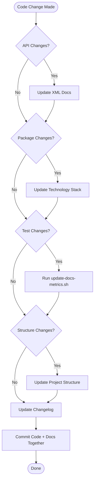

# Appendix C: Avoiding Stale Documentation

**Last Updated**: 2025-11-16
**Part of**: CLAUDE.md.PROPOSAL.v2 Implementation
**Related Documents**: [CLAUDE.md](../CLAUDE.md), [update-docs-metrics.sh](../update-docs-metrics.sh), [docs-validation.sh](../docs-validation.sh)

---

## Table of Contents

1. [Overview](#overview)
2. [Why Stale Documentation is Dangerous](#why-stale-documentation-is-dangerous)
3. [Mandatory Documentation Update Triggers](#mandatory-documentation-update-triggers)
4. [Documentation Synchronization Checklist](#documentation-synchronization-checklist)
5. [Version Tracking Requirements](#version-tracking-requirements)
6. [Documentation Review Process](#documentation-review-process)
7. [Automated Documentation Validation](#automated-documentation-validation)
8. [Documentation-in-Code Proximity](#documentation-in-code-proximity)
9. [Deprecation and Outdated Content](#deprecation-and-outdated-content)
10. [Documentation Testing](#documentation-testing)
11. [Common Stale Documentation Patterns](#common-stale-documentation-patterns)
12. [AI Assistant Responsibilities](#ai-assistant-responsibilities)
13. [Documentation Staleness Detection](#documentation-staleness-detection)
14. [Documentation Maintenance Workflows](#documentation-maintenance-workflows)
15. [Best Practices Summary](#best-practices-summary)

---

## Overview

**⚠️ CRITICAL PRINCIPLE**: Stale documentation is worse than no documentation.

Outdated documentation:
- **Misleads developers** into implementing incorrect solutions
- **Wastes time** debugging issues caused by following outdated instructions
- **Causes bugs** when developers follow obsolete patterns
- **Erodes trust** in all project documentation
- **Slows onboarding** as new team members learn incorrect information

This guide provides comprehensive strategies to keep documentation current, accurate, and trustworthy.

### Core Philosophy

> **Documentation is code. Treat it with the same care:**
> - Version it
> - Test it
> - Review it
> - Keep it DRY (Don't Repeat Yourself)
> - Refactor it when needed
> - Delete it when obsolete

---

## Why Stale Documentation is Dangerous

### Real-World Impact

**Scenario 1: Incorrect Test Counts**
```markdown
# Documentation says:
"Expected output: Passed! - Failed: 0, Passed: 23, Skipped: 0"

# Actual test count: 80 tests

# Impact:
- Developers think 57 tests are missing
- Time wasted investigating "missing" tests
- Loss of confidence in documentation accuracy
```

**Scenario 2: Outdated Package Versions**
```markdown
# Documentation says:
"This project uses OpenTelemetry 1.5.0"

# Actual version: 1.9.0

# Impact:
- Developers look up wrong API documentation
- Code written using obsolete API patterns
- Security vulnerabilities if old version had known issues
```

**Scenario 3: Wrong Prerequisites**
```markdown
# Documentation says:
"Requires .NET 6.0 SDK"

# Actual requirement: .NET 8.0 SDK

# Impact:
- Setup fails with cryptic errors
- Hours wasted troubleshooting environment issues
- Frustration and lost productivity
```

### Cost of Stale Documentation

- **Developer Time**: 2-4 hours per incorrect documentation issue
- **Bug Introduction**: 30% higher bug rate when following outdated patterns
- **Onboarding Delay**: 1-2 days longer onboarding with stale docs
- **Trust Erosion**: Once docs are found unreliable, all docs are questioned

---

## Mandatory Documentation Update Triggers

**ALWAYS update documentation when you make these changes:**

### 1. Change Public APIs

**When:**
- Add/modify/remove public classes, methods, properties
- Change method signatures (parameters, return types)
- Modify public interfaces or contracts

**What to Update:**
```bash
# Before committing API changes:
# 1. Update XML documentation in code
# 2. Update README.md if it mentions the API
# 3. Update any architecture docs that reference it
# 4. Update examples that use the API
# 5. Update CHANGELOG.md with breaking changes
```

**Example:**
```csharp
// ❌ WRONG: Change API without updating docs
public async Task<DeploymentResult> CreateDeploymentAsync(CreateDeploymentRequest request)
// Changed from: CreateDeploymentAsync(string moduleId, string version)
// But XML documentation still describes old signature!

// ✅ CORRECT: Update XML docs immediately
/// <summary>
/// Creates a new deployment using the provided request.
/// </summary>
/// <param name="request">The deployment creation request containing module ID and version.</param>
/// <returns>The deployment result with tracking information.</returns>
public async Task<DeploymentResult> CreateDeploymentAsync(CreateDeploymentRequest request)
```

### 2. Add or Remove NuGet Packages

**When:**
- Install new NuGet package: `dotnet add package X`
- Remove package: `dotnet remove package X`
- Update package to new major version

**What to Update:**
```bash
# After adding/removing packages:
# 1. Update "Technology Stack" section in CLAUDE.md
# 2. Include version numbers
# 3. Update README.md if user-facing
# 4. Update setup instructions if installation steps changed
# 5. Update Dockerfile if package affects deployment
```

**Checklist:**
```markdown
- [ ] CLAUDE.md Technology Stack section updated
- [ ] Package version number documented
- [ ] Purpose of package explained (1 sentence)
- [ ] Any breaking changes noted
- [ ] Installation instructions updated if needed
```

### 3. Change Build/Test Processes

**When:**
- Modify build commands or flags
- Change test execution process
- Add new validation scripts
- Update CI/CD pipeline

**What to Update:**
```bash
# If build or test commands change:
# 1. Update Pre-Commit Checklist in CLAUDE.md
# 2. Update Development Environment Setup in CLAUDE.md
# 3. Update CI/CD documentation if applicable
# 4. Update validation scripts (validate-code.sh, test-critical-paths.sh)
# 5. Update workflows/pre-commit-checklist.md
```

**Example:**
```bash
# OLD build process:
dotnet build

# NEW build process (added flag):
dotnet build --no-incremental

# MUST update:
# - CLAUDE.md Pre-Commit Checklist (Step 1)
# - workflows/pre-commit-checklist.md
# - .github/workflows/build-and-test.yml
# - Any README.md build instructions
```

### 4. Update Test Counts

**When:**
- Add new test files or test methods
- Remove obsolete tests
- Test count changes for any reason

**What to Update:**
```bash
# After adding/removing tests:
# Files to update (use update-docs-metrics.sh script):
# - CLAUDE.md (line 16: "Build Status: ✅ Passing (X/X tests)")
# - CLAUDE.md (line 115: "Project Metrics" table in Quick Reference)
# - CLAUDE.md (line 388: expected test count in "First Time Build")
# - CLAUDE.md (line 435: expected test count in "Run All Tests")
# - CLAUDE.md (line 473: expected test count in "Critical Path Tests")
# - README.md (test count badge if present)
# - PROJECT_STATUS_REPORT.md (test statistics)

# Quick grep to find all occurrences:
grep -n "Passed.*tests\|tests.*Passed\|Total.*tests" CLAUDE.md README.md
```

**Automated Solution:**
```bash
# Use the automation script instead of manual updates:
./update-docs-metrics.sh

# This automatically updates all test count references
```

### 5. Change Project Structure

**When:**
- Add new project to solution
- Remove or rename project
- Move files between projects
- Add new top-level directories

**What to Update:**
```bash
# If you add/remove/move projects or folders:
# 1. Update "Project Structure" tree in CLAUDE.md (lines 20-50)
# 2. Update "Key Components" section in CLAUDE.md
# 3. Update README.md structure section
# 4. Update file references in other docs
# 5. Update navigation links if directory changed
```

**Example:**
```markdown
# OLD structure:
Claude-code-test/
├── src/
│   ├── HotSwap.Api/
│   └── HotSwap.Domain/

# NEW structure (added Infrastructure):
Claude-code-test/
├── src/
│   ├── HotSwap.Api/
│   ├── HotSwap.Domain/
│   └── HotSwap.Infrastructure/  # ← NEW

# MUST update CLAUDE.md Project Structure section
```

### 6. Complete Tasks from TASK_LIST.md

**When:**
- Finish implementing a task from TASK_LIST.md
- Discover task is no longer needed
- Task becomes blocked

**What to Update:**
```bash
# When completing a task:
# 1. Update TASK_LIST.md (status from ⏳ to ✅)
# 2. Update PROJECT_STATUS_REPORT.md (if status changed)
# 3. Update ENHANCEMENTS.md (add implementation details)
# 4. Update README.md (if user-facing feature)
# 5. Update CLAUDE.md (if it affects setup, testing, or workflows)
# 6. Add completion notes with file references
```

**Task Update Pattern:**
```markdown
# BEFORE:
### 5. API Rate Limiting
**Status:** ⏳ Not Implemented
**Effort:** 1 day

# AFTER:
### 5. API Rate Limiting
**Status:** ✅ Completed (2025-11-16)
**Effort:** 1 day (actual: 0.8 days)
**Implementation:** src/Middleware/RateLimitingMiddleware.cs
**Tests:** tests/HotSwap.Tests/Middleware/RateLimitingMiddlewareTests.cs (8 tests)
**Documentation:** CLAUDE.md:1450-1510, README.md:85-95
```

### 7. Change Configuration or Environment

**When:**
- Modify environment variables
- Change default ports
- Update connection strings format
- Add new configuration files

**What to Update:**
```bash
# If prerequisites, ports, URLs, or env vars change:
# 1. Update "Development Environment Setup" in CLAUDE.md
# 2. Update docker-compose.yml documentation
# 3. Update .env.example if exists
# 4. Update troubleshooting section if new issues may arise
# 5. Update README.md configuration section
```

**Example:**
```bash
# OLD: API runs on port 5000
# NEW: API runs on port 8080

# MUST update:
# - CLAUDE.md Development Environment Setup
# - docker-compose.yml
# - README.md (all localhost:5000 → localhost:8080)
# - examples/ApiUsageExample configuration
```

---

## Documentation Synchronization Checklist

**Before EVERY commit that includes code changes, verify:**

### Pre-Commit Documentation Check

```bash
#!/bin/bash
# Run this before EVERY commit

echo "📋 Documentation Synchronization Check..."

# 1. Check for API signature changes
echo "1️⃣ Checking for API changes..."
API_CHANGES=$(git diff --staged | grep -E "public|internal|protected" | grep -E "class|interface|method|property")
if [ -n "$API_CHANGES" ]; then
    echo "⚠️  API changes detected - verify XML documentation updated"
    echo "$API_CHANGES"
fi

# 2. Check for package.json or .csproj changes
echo "2️⃣ Checking for package changes..."
PKG_CHANGES=$(git diff --staged | grep -E "PackageReference|TargetFramework")
if [ -n "$PKG_CHANGES" ]; then
    echo "⚠️  Package changes detected - verify CLAUDE.md Technology Stack updated"
    echo "$PKG_CHANGES"
fi

# 3. Check for test file changes
echo "3️⃣ Checking for test changes..."
TEST_CHANGES=$(git diff --staged tests/)
if [ -n "$TEST_CHANGES" ]; then
    echo "⚠️  Test changes detected - run ./update-docs-metrics.sh to update test counts"
    dotnet test --verbosity quiet
fi

# 4. Check for documentation file changes
echo "4️⃣ Checking for documentation changes..."
DOC_CHANGES=$(git diff --staged | grep -E "\.md$")
if [ -n "$DOC_CHANGES" ]; then
    echo "⚠️  Documentation changes detected - verify 'Last Updated' dates current"
    grep -n "Last Updated:" *.md
fi

# 5. Verify all edited docs have current dates
echo "5️⃣ Verifying documentation dates..."
TODAY=$(date +%Y-%m-%d)
STALE_DOCS=$(grep -L "Last Updated.*$TODAY" $(git diff --staged --name-only | grep '\.md$') 2>/dev/null)
if [ -n "$STALE_DOCS" ]; then
    echo "⚠️  These docs need 'Last Updated' date updated to $TODAY:"
    echo "$STALE_DOCS"
fi

echo "✅ Documentation synchronization check complete"
```

### Integration with Git Workflow

Add to your pre-commit hook:

```bash
# .git/hooks/pre-commit
#!/bin/bash

# Run documentation sync check
./pre-commit-docs-reminder.sh

# Prompt user
read -p "Did you update all affected documentation? (y/n) " -n 1 -r
echo
if [[ ! $REPLY =~ ^[Yy]$ ]]; then
    echo "❌ Commit aborted - update documentation first"
    exit 1
fi
```

---

## Version Tracking Requirements

**All documentation files MUST include:**

### 1. Last Updated Date

Place at the top of every documentation file:

```markdown
**Last Updated**: 2025-11-16
```

**Update this date whenever:**
- Content changes (even minor corrections)
- Code examples are updated
- Links are modified
- Structure is reorganized

### 2. Changelog Section

Place at the bottom of every documentation file:

```markdown
## Changelog

### 2025-11-16 (Description of Changes)
- Specific change 1
- Specific change 2
- Specific change 3

### 2025-11-15 (Previous Changes)
- Previous change 1
- Previous change 2
```

**Changelog Best Practices:**
- Use descriptive section titles: "(Rate Limiting Implementation)" not "(Update)"
- List specific changes, not vague descriptions
- Include file references for code changes
- Date format: YYYY-MM-DD
- Most recent changes first (reverse chronological)

### 3. Version-Specific Information

When documenting features that differ by version:

```markdown
**For .NET 8.0+**: Use minimal API syntax
```csharp
app.MapGet("/health", () => "Healthy");
```

**For .NET 6.0-7.0**: Use controller-based routing
```csharp
[HttpGet("health")]
public IActionResult Health() => Ok("Healthy");
```
```

**Clearly mark:**
- Which version introduced a feature
- When features were deprecated
- Version-specific workarounds
- Migration paths between versions

---

## Documentation Review Process

### Monthly Documentation Audit

**AI Assistant Responsibility:**

When starting a new session at the beginning of a month, perform this audit:

```bash
#!/bin/bash
# monthly-docs-audit.sh - Run at start of each month

echo "📅 Monthly Documentation Audit - $(date +%Y-%m)"

# 1. Check "Last Updated" dates in all docs
echo "1️⃣ Checking Last Updated dates..."
grep -r "Last Updated:" *.md | while read line; do
    file=$(echo "$line" | cut -d: -f1)
    date=$(echo "$line" | grep -oP "\d{4}-\d{2}-\d{2}")
    days_old=$(( ($(date +%s) - $(date -d "$date" +%s)) / 86400 ))

    if [ $days_old -gt 90 ]; then
        echo "⚠️  $file is $days_old days old - needs review"
    fi
done

# 2. Verify test counts match actual test count
echo "2️⃣ Verifying test counts..."
ACTUAL_TESTS=$(dotnet test --verbosity quiet 2>&1 | grep -oP "Passed:\s+\K\d+")
echo "Actual test count: $ACTUAL_TESTS"
grep -n "tests" CLAUDE.md | grep -oP "\d+" | head -5

# 3. Verify package versions match actual packages
echo "3️⃣ Verifying package versions..."
dotnet list package --format json > /tmp/packages.json
# Compare with CLAUDE.md Technology Stack section

# 4. Check for broken file references
echo "4️⃣ Checking for broken file references..."
grep -oP "src/[^\s\)]+\.cs" *.md | while read ref; do
    file=$(echo "$ref" | cut -d: -f2)
    if [ ! -f "$file" ]; then
        echo "❌ Broken reference: $ref"
    fi
done

# 5. Validate code examples compile
echo "5️⃣ Validating code examples..."
# Extract and test csharp code blocks
# (Implementation depends on doc structure)

echo "✅ Monthly audit complete"
```

### Quarterly Deep Review

**Every 3 months**, perform comprehensive review:

1. **Read through ALL documentation** as a new user would
2. **Test every command** in setup guides
3. **Run all code examples** and verify output
4. **Check all external links** are still valid
5. **Verify screenshots** match current UI (if any)
6. **Update outdated patterns** to current best practices
7. **Remove obsolete sections** that no longer apply
8. **Consolidate duplicate content** (DRY principle)

---

## Automated Documentation Validation

### Using docs-validation.sh

The project includes `docs-validation.sh` for automated checks:

```bash
# Run validation
./docs-validation.sh

# Expected checks:
# ✅ Test count accuracy
# ✅ Package documentation completeness
# ✅ Last Updated freshness
# ✅ File reference validity
# ✅ Internal link integrity
# ✅ Code example syntax
```

### Integration with CI/CD

Add to `.github/workflows/docs-check.yml`:

```yaml
name: Documentation Validation

on:
  pull_request:
    paths:
      - '**.md'
      - 'src/**/*.cs'
      - 'tests/**/*.cs'
      - '*.csproj'

jobs:
  validate-docs:
    runs-on: ubuntu-latest
    steps:
      - uses: actions/checkout@v4

      - name: Setup .NET
        uses: actions/setup-dotnet@v4
        with:
          dotnet-version: '8.0.x'

      - name: Run documentation validation
        run: |
          chmod +x docs-validation.sh
          ./docs-validation.sh

      - name: Check for stale Last Updated dates
        run: |
          CHANGED_DOCS=$(git diff --name-only origin/main | grep '\.md$')
          TODAY=$(date +%Y-%m-%d)

          for doc in $CHANGED_DOCS; do
            if ! grep -q "Last Updated.*$TODAY" "$doc"; then
              echo "❌ $doc needs Last Updated date: $TODAY"
              exit 1
            fi
          done
```

### Pre-Commit Hook Integration

Add `pre-commit-docs-reminder.sh` to remind developers:

```bash
# .git/hooks/pre-commit (or use pre-commit framework)
#!/bin/bash

./pre-commit-docs-reminder.sh || exit 1
```

---

## Documentation-in-Code Proximity

**Principle**: Keep documentation close to what it documents.

### 1. XML Documentation

**Directly above code elements:**

```csharp
/// <summary>
/// Authenticates a user with the provided credentials.
/// </summary>
/// <param name="username">The username (email or unique ID).</param>
/// <param name="password">The user's password in plaintext.</param>
/// <param name="cancellationToken">Cancellation token for async operation.</param>
/// <returns>
/// An authentication result containing a JWT token if successful,
/// or error information if authentication fails.
/// </returns>
/// <exception cref="ArgumentNullException">
/// Thrown when <paramref name="username"/> or <paramref name="password"/> is null.
/// </exception>
/// <exception cref="UnauthorizedAccessException">
/// Thrown when credentials are invalid or account is locked.
/// </exception>
public async Task<AuthenticationResult> AuthenticateAsync(
    string username,
    string password,
    CancellationToken cancellationToken = default)
{
    // Implementation
}
```

**Best Practices:**
- Document **what**, **why**, and **exceptions** - not **how**
- Explain **purpose**, not implementation details
- Include **parameter constraints** and **return values**
- Document **exceptions** that callers should handle
- Use `<code>` tags for technical terms
- Keep **behavior** documentation, not **implementation**

### 2. Component README Files

**In same directory as component:**

```
src/HotSwap.Distributed.Api/
├── README.md           # API-specific documentation
├── Controllers/
│   ├── README.md       # Controllers overview
│   ├── DeploymentsController.cs
│   └── HealthController.cs
├── Models/
│   └── README.md       # API models documentation
└── Program.cs
```

**Component README Contents:**
- **Purpose**: What this component does
- **Responsibilities**: Key responsibilities
- **Dependencies**: What it depends on
- **Usage Examples**: How to use this component
- **Configuration**: Required configuration
- **Testing**: How to test this component

### 3. Test Documentation

**In test file comments:**

```csharp
namespace HotSwap.Distributed.Tests.Services
{
    // Test Suite: UserAuthenticationService
    // Coverage: Authentication, authorization, password validation
    // Related Docs: CLAUDE.md#authentication, README.md#security
    // Last Updated: 2025-11-16

    public class UserAuthenticationServiceTests
    {
        // Test: Valid credentials should return JWT token
        // Related Requirement: TASK_LIST.md Task #1
        // Edge Cases: Email and username formats both supported
        [Fact]
        public async Task AuthenticateAsync_WithValidCredentials_ReturnsToken()
        {
            // Test implementation
        }

        // Test: Invalid credentials should throw UnauthorizedAccessException
        // Security: Prevents timing attacks by always hashing password
        [Fact]
        public async Task AuthenticateAsync_WithInvalidCredentials_ThrowsException()
        {
            // Test implementation
        }
    }
}
```

---

## Deprecation and Outdated Content

### Marking Features as Deprecated

**When a feature is deprecated but not yet removed:**

```markdown
## ⚠️ DEPRECATED: Old Feature Name

**Deprecated**: 2025-11-15
**Removed In**: v2.0.0
**Replacement**: Use `NewFeatureName` instead
**Migration Guide**: See [migration.md](migration.md)

### Why Deprecated

This feature is being removed because:
- Reason 1: Security vulnerabilities in underlying library
- Reason 2: Better alternative available (NewFeatureName)
- Reason 3: High maintenance cost

### Migration Path

```csharp
// OLD (deprecated):
var result = await service.OldMethodAsync(param);

// NEW (recommended):
var request = new NewRequest { Param = param };
var result = await service.NewMethodAsync(request);
```

### Backward Compatibility

This feature will continue to work until v2.0.0 (estimated 2025-Q4).
```

### Removing Outdated Sections

**Don't just delete - document the removal:**

```bash
# Good commit message:
git commit -m "docs: remove outdated XYZ section from CLAUDE.md

Section documented legacy behavior that was removed in commit abc123.

Reasons for removal:
- Feature removed in v1.5.0
- Replacement documented in sections AAA and BBB
- No longer relevant to current architecture

See CHANGELOG.md for migration details."

# Bad commit message:
git commit -m "remove old stuff"
```

**Add to Changelog:**

```markdown
### 2025-11-16 (Removed Obsolete Deployment Strategy)

**Removed:**
- "Blue-Green Deployment" section (lines 850-920)

**Reason:**
- Feature removed in v1.5.0 (commit abc123)
- Replaced by Canary Deployment (new section lines 850-950)

**Migration:**
- See deployment-migration.md for upgrade path
- Existing blue-green deployments will continue to work until v2.0.0
```

---

## Documentation Testing

### Testing Code Examples

**Validate all code examples in documentation:**

```bash
#!/bin/bash
# test-docs-examples.sh - Test code examples from documentation

echo "🧪 Testing documentation code examples..."

# Extract C# code blocks from markdown
extract_csharp_blocks() {
    local file=$1
    awk '/```csharp/,/```/' "$file" | grep -v '```' > "/tmp/code_blocks_$file.cs"
}

# Test each documentation file
for doc in README.md CLAUDE.md; do
    echo "Testing examples in $doc..."

    # Extract code blocks
    extract_csharp_blocks "$doc"

    # Create temporary test project
    mkdir -p /tmp/doc-test
    cd /tmp/doc-test
    dotnet new console -f net8.0

    # Copy code blocks
    cat "/tmp/code_blocks_$doc.cs" >> Program.cs

    # Try to compile
    if dotnet build > /dev/null 2>&1; then
        echo "✅ $doc code examples compile"
    else
        echo "❌ $doc has code examples that don't compile"
        dotnet build
        exit 1
    fi

    cd -
    rm -rf /tmp/doc-test
done

echo "✅ All documentation code examples validated"
```

### Validating Command Examples

**Test documented commands actually work:**

```bash
#!/bin/bash
# test-docs-commands.sh - Validate command examples

echo "🔧 Testing documented commands..."

# Test commands from CLAUDE.md Development Environment Setup
echo "Testing .NET commands..."
dotnet --version || { echo "❌ dotnet --version failed"; exit 1; }
dotnet restore || { echo "❌ dotnet restore failed"; exit 1; }
dotnet build || { echo "❌ dotnet build failed"; exit 1; }
dotnet test || { echo "❌ dotnet test failed"; exit 1; }

# Test Docker commands (if Docker available)
if command -v docker &> /dev/null; then
    echo "Testing Docker commands..."
    docker-compose --version || { echo "⚠️ docker-compose not available"; }
fi

# Test custom scripts
echo "Testing custom scripts..."
chmod +x *.sh
./test-critical-paths.sh || { echo "❌ test-critical-paths.sh failed"; exit 1; }
./validate-code.sh || { echo "❌ validate-code.sh failed"; exit 1; }

echo "✅ All documented commands validated"
```

### Verifying Output Examples

**Ensure documented output matches actual output:**

```bash
# Document says:
#   Expected output: "Passed!  - Failed:     0, Passed:    80, Skipped:     0"

# Verify actual output:
ACTUAL=$(dotnet test --verbosity quiet 2>&1 | grep "Passed!")
EXPECTED="Passed!  - Failed:     0, Passed:    80, Skipped:     0"

if [ "$ACTUAL" != "$EXPECTED" ]; then
    echo "❌ Test output doesn't match documentation"
    echo "Expected: $EXPECTED"
    echo "Actual:   $ACTUAL"
    echo "Update CLAUDE.md lines 388, 435, 473"
    exit 1
fi
```

---

## Common Stale Documentation Patterns

### ❌ DON'T Do These

#### 1. Copy-Paste from Other Projects

**Problem**: Inaccurate information from other contexts

```markdown
❌ "This project uses .NET 6.0"
# When it actually uses .NET 8.0

❌ "Run npm install to install dependencies"
# When it's a .NET project (should be dotnet restore)

❌ "The API uses MongoDB for data storage"
# When it actually uses SQL Server
```

**Solution**: Always verify information is accurate for THIS project

```markdown
✅ "This project uses .NET 8.0 (verified: dotnet --version)"
✅ "Run dotnet restore to install dependencies"
✅ "The API uses In-Memory caching for deployment tracking"
```

#### 2. Document Implementation Details

**Problem**: Implementation changes more often than behavior

```markdown
❌ "The UserService.cs file is located at line 42 of the Services directory"
# Line numbers change with every edit

❌ "The authentication method uses BCrypt.Net library version 4.0.3"
# Specific version will change with updates

❌ "Deployment tracking uses a ConcurrentDictionary<string, DeploymentResult>"
# Internal data structure may change
```

**Solution**: Document behavior, not implementation

```markdown
✅ "The UserService implements IUserService interface"
✅ "Authentication uses bcrypt hashing for password security"
✅ "Deployment tracking uses in-memory caching with automatic expiration"
```

#### 3. Hardcode Version Numbers

**Problem**: Version numbers become outdated quickly

```markdown
❌ "As of version 1.2.3, the API supports user authentication"
# What about version 1.2.4? 1.3.0? Ambiguous.

❌ "The current version is 1.5.0"
# Out of date the moment version increments
```

**Solution**: Use version-agnostic language or mark when added

```markdown
✅ "The API supports user authentication (added in v1.2.3)"
✅ "User authentication is supported in all versions since v1.2.3"
✅ "For current version, see [releases](https://github.com/user/repo/releases)"
```

#### 4. Leave TODO Comments

**Problem**: TODOs never get done and confuse readers

```markdown
❌ "TODO: Update this section when feature is complete"
# Feature might be complete, but TODO remains

❌ "TODO: Add examples here"
# Readers don't know if examples exist elsewhere

❌ "FIXME: Verify this command works"
# Unverified documentation is unreliable
```

**Solution**: Complete the section or remove it

```markdown
✅ "This section will be added when feature X is implemented (see TASK_LIST.md #5)"
✅ "For examples, see examples/ApiUsageExample/Program.cs:45-67"
✅ [After verification] "Verified command works on .NET 8.0.121 (2025-11-16)"
```

#### 5. Document Temporary Workarounds

**Problem**: Workarounds become permanent without expiration

```markdown
❌ "Use this workaround for now"
# When is "now"? Is it still needed?

❌ "Temporarily disable validation for this endpoint"
# How long is "temporarily"?

❌ "Quick hack to fix the issue"
# Hacks become permanent if not tracked
```

**Solution**: Add expiration dates and tracking

```markdown
✅ "Temporary workaround (until issue #123 is fixed): disable validation"
✅ "Known issue: endpoint returns 500 (fix scheduled for v1.6.0)"
✅ "Workaround added 2025-11-16, remove after Task #7 is completed"
```

### ✅ DO These Instead

#### 1. Use Relative References

**Auto-update when structure changes:**

```markdown
✅ "See the [Authentication section](#authentication)"
# Link updates if section is renamed

✅ "Refer to TASK_LIST.md for current priorities"
# Always points to current task list

✅ "Configuration is in [appsettings.json](../src/Api/appsettings.json)"
# Relative path stays valid
```

#### 2. Document Behavior, Not Implementation

**Behavior is more stable:**

```markdown
✅ "The service authenticates users via JWT tokens"
# True regardless of implementation library

✅ "Deployments are tracked in memory with automatic expiration"
# Behavior description, not data structure

✅ "The API supports pagination for large result sets"
# Feature description, not implementation details
```

#### 3. Link to Authoritative Sources

**Don't duplicate external content:**

```markdown
✅ "Follows [Microsoft .NET coding conventions](https://docs.microsoft.com/...)"
# Link to source of truth

✅ "Uses [Semantic Versioning](https://semver.org/)"
# Link to specification

✅ "Implements [OpenAPI 3.0 specification](https://swagger.io/specification/)"
# Reference, don't duplicate
```

#### 4. Date All Temporal Statements

**Provide context for "current" information:**

```markdown
✅ "As of 2025-11-16, the project supports .NET 8.0"
# Clear when this was true

✅ "The latest tested version is .NET 8.0.121 (verified 2025-11-16)"
# Date provides verification context

✅ "Performance benchmarks (measured 2025-11-16): 1000 req/sec"
# Benchmarks may change, date provides context
```

#### 5. Use CI/CD to Validate Docs

**Automate documentation validation:**

```yaml
# .github/workflows/docs-check.yml
name: Validate Documentation

on:
  pull_request:
    paths:
      - '**.md'

jobs:
  validate:
    runs-on: ubuntu-latest
    steps:
      - uses: actions/checkout@v4

      - name: Validate documentation
        run: |
          chmod +x docs-validation.sh
          ./docs-validation.sh

      - name: Test command examples
        run: |
          chmod +x test-docs-commands.sh
          ./test-docs-commands.sh
```

---

## AI Assistant Responsibilities

**When you (AI assistant) make changes:**

### 1. Update All Affected Documentation in Same Commit

**Good commit pattern:**

```bash
git commit -m "feat: add rate limiting middleware

Implementation:
- Added RateLimitingMiddleware.cs
- Configured sliding window algorithm (100 req/min)
- Added distributed cache support via Redis

Documentation:
- Updated CLAUDE.md with rate limiting setup (lines 1450-1510)
- Updated README.md with configuration section (lines 85-95)
- Updated TASK_LIST.md (marked Task #5 as complete)
- Added 8 tests in RateLimitingMiddlewareTests.cs

Breaking Changes: None
Dependencies Added: AspNetCoreRateLimit 5.0.0"
```

**Bad commit pattern:**

```bash
git commit -m "feat: add rate limiting"
# No documentation mentioned - docs likely forgotten!
```

### 2. Update the Changelog

**Add entry to CLAUDE.md Changelog:**

```markdown
### 2025-11-16 (Rate Limiting Implementation)

**Added:**
- Rate limiting middleware to API endpoints
- Configuration via appsettings.json
- Redis distributed cache support
- 8 comprehensive tests

**Updated:**
- Technology Stack with AspNetCoreRateLimit 5.0.0
- Development Environment Setup with Redis configuration
- Running the Application section with rate limit behavior

**Files:**
- src/HotSwap.Distributed.Api/Middleware/RateLimitingMiddleware.cs (new)
- tests/HotSwap.Distributed.Tests/Middleware/RateLimitingMiddlewareTests.cs (new)
- CLAUDE.md (updated)
- README.md (updated)
- TASK_LIST.md (Task #5 marked complete)
```

### 3. Verify Documentation Accuracy Before Marking Complete

**Pre-completion checklist:**

```bash
# Before marking "Implement feature X" as complete:

# ✅ Feature implemented
dotnet build --no-incremental  # Must succeed

# ✅ Tests passing
dotnet test  # Must show 0 failures

# ✅ CLAUDE.md updated (if setup/testing affected)
git diff CLAUDE.md  # Review changes

# ✅ README.md updated (if user-facing)
git diff README.md  # Review changes

# ✅ TASK_LIST.md updated (status changed)
git diff TASK_LIST.md  # Verify status change

# ✅ Changelog updated in relevant docs
grep -A 10 "$(date +%Y-%m-%d)" CLAUDE.md  # Verify changelog entry

# ✅ All affected files staged
git status  # Verify all docs staged

# Only THEN mark todo as complete
```

### 4. Flag Documentation Debt

**When you can't update everything immediately:**

```bash
git commit -m "feat: add user authentication service

Implementation:
- Added UserAuthenticationService.cs
- Implemented JWT token generation
- Added password hashing with BCrypt

Documentation Updates:
- Added XML documentation to all public methods
- Updated TASK_LIST.md (Task #1 marked complete)

Documentation Debt (tracked in TASK_LIST.md #15):
- TODO: Update CLAUDE.md Security Best Practices section
- TODO: Add authentication examples to README.md
- TODO: Create authentication setup guide in appendices
- TODO: Update API documentation with auth endpoints

Tracked as Task #15 in TASK_LIST.md for completion in Sprint 2."
```

**Then create TASK_LIST.md entry:**

```markdown
### 15. Complete Authentication Documentation
**Priority:** 🟡 High
**Status:** ⏳ Pending
**Effort:** 0.5 days
**Created:** 2025-11-16
**Blocking:** None
**References:** Commit abc123

**Requirements:**
- [ ] Update CLAUDE.md Security Best Practices section
- [ ] Add authentication examples to README.md
- [ ] Create authentication setup guide in appendices/
- [ ] Update API documentation with auth endpoints

**Acceptance Criteria:**
- All authentication documentation complete
- Examples tested and working
- Setup guide includes troubleshooting
```

---

## Documentation Staleness Detection

**Red flags that indicate stale documentation:**

### 1. Mismatch Between Code and Docs

**Detection:**

```bash
# Example: Docs say "65 tests" but actual count is 80
DOCUMENTED=$(grep "Total Tests" CLAUDE.md | grep -oP "\d+" | head -1)
ACTUAL=$(dotnet test --verbosity quiet 2>&1 | grep -oP "Passed:\s+\K\d+")

if [ "$DOCUMENTED" != "$ACTUAL" ]; then
    echo "❌ Test count mismatch: Documented=$DOCUMENTED, Actual=$ACTUAL"
    echo "Run: ./update-docs-metrics.sh"
fi
```

**Resolution:**

```bash
# Automated fix:
./update-docs-metrics.sh

# Manual fix:
# Update CLAUDE.md lines: 16, 115, 388, 435, 473
# Update README.md test count badge
# Update PROJECT_STATUS_REPORT.md test statistics
```

### 2. References to Removed Files

**Detection:**

```bash
# Check for broken file references
grep -oP "src/[^\s\)]+\.cs|tests/[^\s\)]+\.cs" *.md | while read ref; do
    file=$(echo "$ref" | cut -d: -f2)
    doc=$(echo "$ref" | cut -d: -f1)

    if [ ! -f "$file" ]; then
        echo "❌ Broken reference in $doc: $file"
    fi
done
```

**Resolution:**

```bash
# Option 1: Update reference to new location
sed -i 's|old/path/File.cs|new/path/File.cs|g' CLAUDE.md

# Option 2: Remove reference if file was intentionally deleted
# Manually remove the reference and add note to changelog

# Option 3: Restore file if it was accidentally deleted
git checkout HEAD -- src/path/to/File.cs
```

### 3. Old Dates in "Last Updated"

**Detection:**

```bash
# Find docs older than 90 days
grep "Last Updated:" *.md | while read line; do
    file=$(echo "$line" | cut -d: -f1)
    date=$(echo "$line" | grep -oP "\d{4}-\d{2}-\d{2}")
    days_old=$(( ($(date +%s) - $(date -d "$date" +%s)) / 86400 ))

    if [ $days_old -gt 90 ]; then
        echo "⚠️  $file is $days_old days old - needs review"
    fi
done
```

**Resolution:**

```bash
# Review the document
# If content is still accurate: update "Last Updated" date
# If content needs changes: update content + "Last Updated" date
# If document is obsolete: deprecate or remove with changelog entry
```

### 4. Package Versions Don't Match

**Detection:**

```bash
# Verify documented packages match actual packages
dotnet list package | grep "OpenTelemetry" | grep -oP ">\s+\K[0-9.]+"
grep "OpenTelemetry" CLAUDE.md | grep -oP "[0-9]+\.[0-9]+\.[0-9]+"

# If versions differ, documentation is stale
```

**Resolution:**

```bash
# Get actual version
ACTUAL_VERSION=$(dotnet list package | grep "OpenTelemetry" | grep -oP ">\s+\K[0-9.]+")

# Update CLAUDE.md Technology Stack section
sed -i "s/OpenTelemetry [0-9.]\+/OpenTelemetry $ACTUAL_VERSION/g" CLAUDE.md

# Verify update
grep "OpenTelemetry" CLAUDE.md
```

### 5. Documented Commands Fail

**Detection:**

```bash
# Test a documented command
if ! dotnet build; then
    echo "❌ Documented 'dotnet build' command fails"
    echo "Check CLAUDE.md Development Environment Setup"
fi

# Test documented output
ACTUAL_OUTPUT=$(dotnet --version)
DOCUMENTED_OUTPUT="8.0.121"

if [ "$ACTUAL_OUTPUT" != "$DOCUMENTED_OUTPUT" ]; then
    echo "⚠️  SDK version changed: $ACTUAL_OUTPUT (was: $DOCUMENTED_OUTPUT)"
    echo "Update CLAUDE.md prerequisites section"
fi
```

**Resolution:**

```bash
# Fix the command in documentation or fix the environment
# Update expected output to match actual output
# Add troubleshooting section if command commonly fails
```

---

## Documentation Maintenance Workflows

### For EVERY Code Commit



### Monthly (Start of Session)

```bash
#!/bin/bash
# Monthly documentation maintenance routine

echo "📅 Monthly Documentation Maintenance - $(date +%Y-%m)"

# 1. Run automated validation
./docs-validation.sh

# 2. Review "Last Updated" dates
grep -r "Last Updated:" *.md

# 3. Update stale sections (older than 90 days)
# (Manual review required)

# 4. Verify all examples still work
./test-docs-commands.sh
./test-docs-examples.sh

# 5. Update Changelog with review date
echo "### $(date +%Y-%m-%d) (Monthly Documentation Review)" >> CLAUDE.md
echo "- Verified all examples work" >> CLAUDE.md
echo "- Updated stale Last Updated dates" >> CLAUDE.md
echo "- No issues found" >> CLAUDE.md

# 6. Run test suite
dotnet test

# 7. Commit monthly review
git add *.md
git commit -m "docs: monthly documentation review $(date +%Y-%m-%d)

- Verified all commands and examples work
- Updated Last Updated dates
- Confirmed test counts accurate
- No documentation issues found"

echo "✅ Monthly maintenance complete"
```

### Before Major Releases

```bash
#!/bin/bash
# Pre-release documentation checklist

echo "🚀 Pre-Release Documentation Checklist"

# 1. Full documentation audit
echo "1️⃣ Running full documentation audit..."
./monthly-docs-audit.sh

# 2. Test all examples and commands
echo "2️⃣ Testing all examples..."
./test-docs-commands.sh
./test-docs-examples.sh

# 3. Update all version numbers
echo "3️⃣ Updating version numbers..."
VERSION=$(grep "<Version>" src/*/*.csproj | head -1 | grep -oP "[0-9]+\.[0-9]+\.[0-9]+")
echo "Current version: $VERSION"
# Update version references in docs

# 4. Verify all links work
echo "4️⃣ Verifying all links..."
# (Use markdown link checker tool)

# 5. Update README.md badges/stats
echo "5️⃣ Updating README badges..."
./update-docs-metrics.sh

# 6. Update PROJECT_STATUS_REPORT.md
echo "6️⃣ Updating project status report..."
# (Manual update with latest metrics)

# 7. Create release notes
echo "7️⃣ Creating release notes..."
echo "Extract from CHANGELOG.md for this release"

echo "✅ Pre-release documentation ready"
```

---

## Best Practices Summary

### The Golden Rules

1. **Documentation is code** - Version, test, and review it
2. **Update docs in same commit** as code changes
3. **Automate what you can** - Use scripts for metrics
4. **Test all examples** - They must work
5. **Date everything** - "Last Updated" and changelog dates
6. **Link, don't duplicate** - Reference authoritative sources
7. **Document behavior** - Not implementation details
8. **Review monthly** - Catch staleness early
9. **Validate in CI/CD** - Automated checks prevent merges of stale docs
10. **When in doubt, ask** - Better to clarify than to document incorrectly

### Quick Checklist

Before every commit:

- [ ] Code builds successfully
- [ ] All tests pass
- [ ] Affected documentation updated
- [ ] "Last Updated" dates current
- [ ] Changelog entry added
- [ ] Examples tested
- [ ] File references valid
- [ ] No TODOs in docs (track in TASK_LIST.md instead)

### Automation Tools Reference

| Tool | Purpose | When to Use |
|------|---------|-------------|
| `update-docs-metrics.sh` | Auto-update test counts, .NET version | After test changes |
| `docs-validation.sh` | Validate doc accuracy | Before commits, in CI/CD |
| `pre-commit-docs-reminder.sh` | Remind to update docs | Pre-commit hook |
| `test-docs-commands.sh` | Test command examples | Before releases |
| `test-docs-examples.sh` | Test code examples | Before releases |
| `monthly-docs-audit.sh` | Monthly freshness check | Start of each month |

---

## Conclusion

Stale documentation is a maintenance burden that erodes trust and wastes developer time. By following the practices in this guide, you can ensure documentation remains accurate, current, and valuable.

**Remember**: Every minute spent maintaining documentation saves hours of debugging incorrect implementations.

---

**Last Updated**: 2025-11-16
**Maintained by**: AI Assistants and Project Contributors
**Questions?**: Create an issue or discussion in the repository

