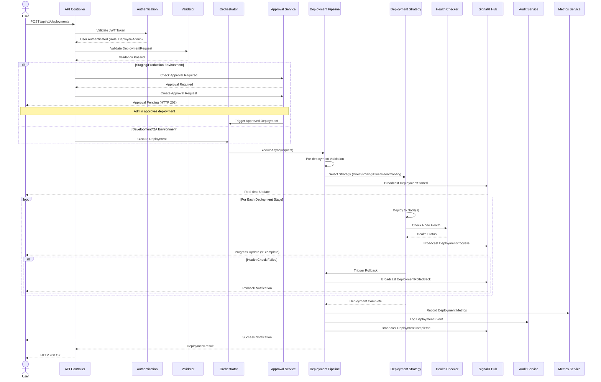
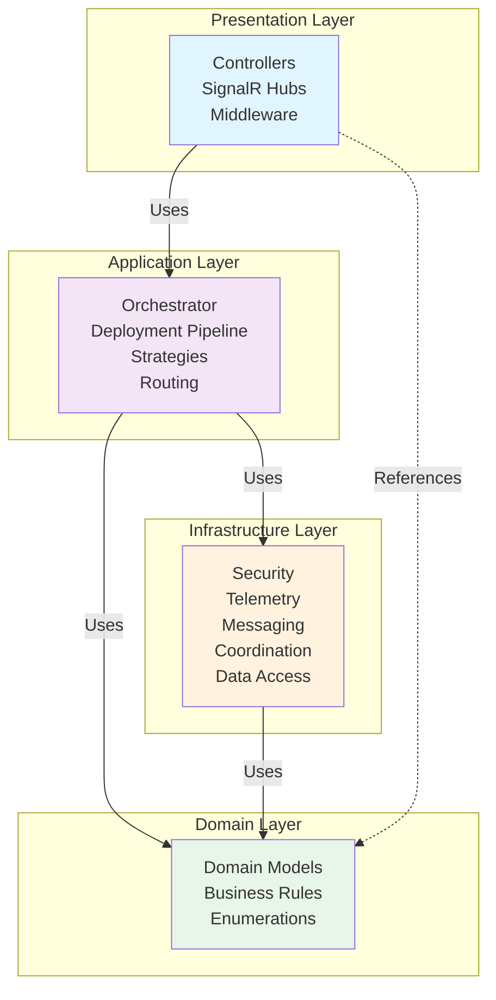
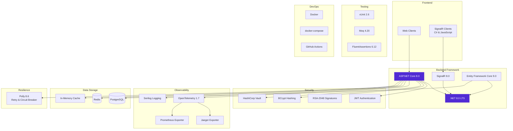
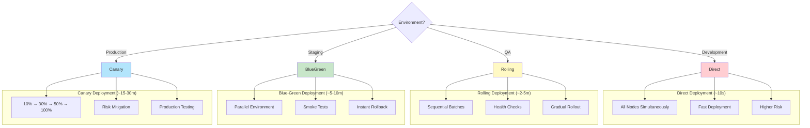
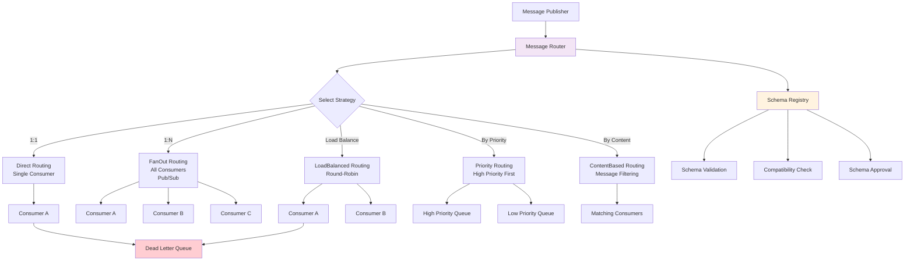
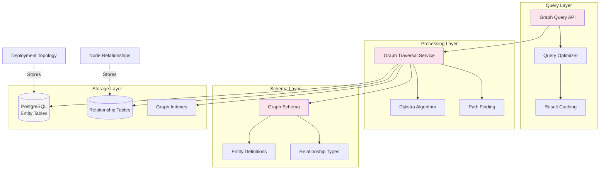
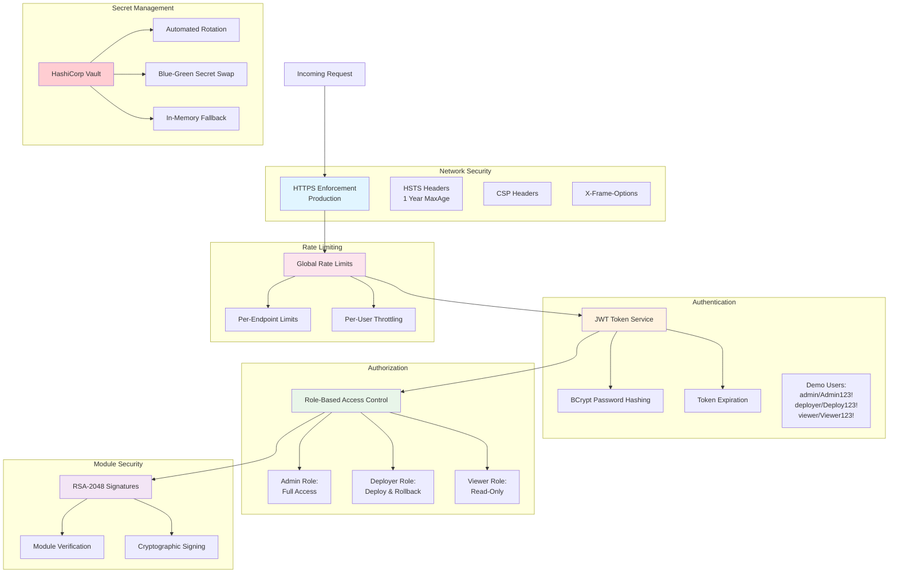
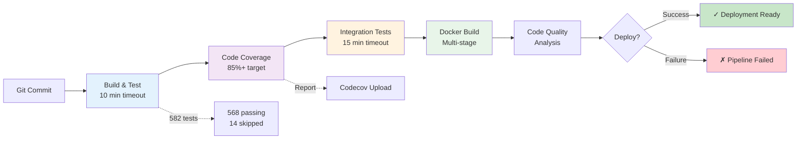

# Distributed Kernel Orchestration System - Architecture Diagram

## Overview

This document provides a comprehensive architectural diagram of the Distributed Kernel Orchestration System, a production-ready enterprise platform for managing hot-swappable kernel modules across distributed node clusters.

## High-Level Architecture

```mermaid
graph TB
    subgraph "External Clients"
        WebClient[Web Client]
        MobileApp[Mobile App]
        CLI[CLI Tool]
        SignalRClient[SignalR Client]
    end

    subgraph "API Layer - HotSwap.Distributed.Api"
        Controllers[Controllers<br/>13 REST Endpoints]
        Hubs[SignalR Hubs<br/>DeploymentHub]
        Middleware[Middleware Pipeline<br/>Security, Auth, Rate Limiting]
        Validators[FluentValidation<br/>Request Validators]
    end

    subgraph "Orchestration Layer - HotSwap.Distributed.Orchestrator"
        Orchestrator[DistributedKernelOrchestrator<br/>Central Coordinator]
        Pipeline[DeploymentPipeline<br/>Multi-Stage Execution]

        subgraph "Deployment Strategies"
            DirectStrategy[Direct<br/>~10s]
            RollingStrategy[Rolling<br/>~2-5m]
            BlueGreenStrategy[Blue-Green<br/>~5-10m]
            CanaryStrategy[Canary<br/>~15-30m]
        end

        subgraph "Message Routing"
            MessageRouter[MessageRouter]
            DirectRouting[Direct]
            FanOutRouting[FanOut]
            LoadBalanced[LoadBalanced]
            Priority[Priority]
            ContentBased[ContentBased]
        end

        ApprovalService[Approval Service<br/>Workflow Engine]
        AuditService[Audit Service<br/>Event Logging]
    end

    subgraph "Infrastructure Layer - HotSwap.Distributed.Infrastructure"
        subgraph "Security & Auth"
            JWTService[JWT Token Service<br/>BCrypt Hashing]
            SecretMgmt[Secret Management<br/>Vault/In-Memory]
            ModuleVerify[Module Verification<br/>RSA-2048 Signatures]
        end

        subgraph "Observability"
            Telemetry[OpenTelemetry<br/>Distributed Tracing]
            MetricsService[Metrics Service<br/>Aggregation & Caching]
            Analytics[Analytics<br/>Usage Reports]
        end

        subgraph "Data Services"
            Coordination[Coordination<br/>In-Memory Locks (C# SemaphoreSlim)]
            Messaging[Message Queue<br/>Persistence & Delivery]
            SchemaRegistry[Schema Registry<br/>Validation & Versioning]
            DeploymentTracker[Deployment Tracker<br/>State Management]
        end

        subgraph "Multi-Tenancy"
            TenantContext[Tenant Context<br/>Isolation]
            TenantProvisioning[Tenant Provisioning<br/>Config Management]
        end

        NotificationService[Notification Service<br/>SignalR Integration]
    end

    subgraph "Domain Layer - HotSwap.Distributed.Domain"
        DomainModels[Domain Models<br/>30+ Entities]
        Enums[Enumerations<br/>20+ Types]
        BusinessLogic[Business Rules<br/>Pure Domain Logic]
    end

    subgraph "Knowledge Graph Subsystem"
        QueryEngine[Query Engine<br/>HotSwap.KnowledgeGraph.QueryEngine]
        GraphInfra[Graph Infrastructure<br/>Storage & Indexing]
        GraphDomain[Graph Domain<br/>Entities & Relationships]

        QueryEngine --> GraphInfra
        GraphInfra --> GraphDomain

        subgraph "Query Features"
            Optimizer[Query Optimizer]
            Traversal[Graph Traversal<br/>Dijkstra Algorithm]
            Caching[Result Caching]
        end

        QueryEngine --> Optimizer
        QueryEngine --> Traversal
        QueryEngine --> Caching
    end

    subgraph "External Systems"
        PostgreSQL[(PostgreSQL<br/>Audit Logs & Graph)]
        Redis[(Redis<br/>Distributed Locks)]
        Vault[HashiCorp Vault<br/>Secret Storage]
        Jaeger[Jaeger<br/>Trace Visualization]
        Prometheus[Prometheus<br/>Metrics Collection]
    end

    %% Client Connections
    WebClient --> Controllers
    MobileApp --> Controllers
    CLI --> Controllers
    SignalRClient --> Hubs

    %% API Layer Flow
    Controllers --> Middleware
    Hubs --> Middleware
    Middleware --> Validators
    Controllers --> Orchestrator
    Hubs --> NotificationService

    %% Orchestrator Dependencies
    Orchestrator --> Pipeline
    Pipeline --> DirectStrategy
    Pipeline --> RollingStrategy
    Pipeline --> BlueGreenStrategy
    Pipeline --> CanaryStrategy
    Orchestrator --> ApprovalService
    Orchestrator --> AuditService

    MessageRouter --> DirectRouting
    MessageRouter --> FanOutRouting
    MessageRouter --> LoadBalanced
    MessageRouter --> Priority
    MessageRouter --> ContentBased
    MessageRouter --> SchemaRegistry

    %% Infrastructure Integration
    Pipeline --> JWTService
    Pipeline --> SecretMgmt
    Pipeline --> ModuleVerify
    Pipeline --> Telemetry
    Pipeline --> MetricsService
    Pipeline --> Coordination
    Pipeline --> Messaging
    Pipeline --> DeploymentTracker
    Pipeline --> TenantContext

    ApprovalService --> AuditService
    AuditService --> DomainModels

    %% Domain Dependencies
    Orchestrator --> DomainModels
    Orchestrator --> BusinessLogic
    JWTService --> DomainModels
    SecretMgmt --> DomainModels
    Messaging --> DomainModels

    %% Knowledge Graph Integration
    Orchestrator --> QueryEngine
    DeploymentTracker --> GraphInfra

    %% External System Connections
    AuditService -.-> PostgreSQL
    GraphInfra -.-> PostgreSQL
    Coordination -.-> Redis
    SecretMgmt -.-> Vault
    Telemetry -.-> Jaeger
    MetricsService -.-> Prometheus

    classDef apiLayer fill:#e1f5ff,stroke:#01579b,stroke-width:2px
    classDef orchestratorLayer fill:#f3e5f5,stroke:#4a148c,stroke-width:2px
    classDef infraLayer fill:#fff3e0,stroke:#e65100,stroke-width:2px
    classDef domainLayer fill:#e8f5e9,stroke:#1b5e20,stroke-width:2px
    classDef graphLayer fill:#fce4ec,stroke:#880e4f,stroke-width:2px
    classDef externalLayer fill:#f5f5f5,stroke:#424242,stroke-width:2px

    class Controllers,Hubs,Middleware,Validators apiLayer
    class Orchestrator,Pipeline,DirectStrategy,RollingStrategy,BlueGreenStrategy,CanaryStrategy,MessageRouter,ApprovalService,AuditService orchestratorLayer
    class JWTService,SecretMgmt,ModuleVerify,Telemetry,MetricsService,Analytics,Coordination,Messaging,SchemaRegistry,DeploymentTracker,TenantContext,TenantProvisioning,NotificationService infraLayer
    class DomainModels,Enums,BusinessLogic domainLayer
    class QueryEngine,GraphInfra,GraphDomain,Optimizer,Traversal,Caching graphLayer
    class PostgreSQL,Redis,Vault,Jaeger,Prometheus externalLayer
```

## Deployment Flow



## Request Processing Pipeline

```mermaid
graph LR
    Request[HTTP Request] --> Exception[Exception Handler]
    Exception --> Security[Security Headers]
    Security --> Logging[Request Logging]
    Logging --> RateLimit[Rate Limiting]
    RateLimit --> Auth[Authentication]
    Auth --> Authz[Authorization]
    Authz --> TenantCtx[Tenant Context]
    TenantCtx --> Controller[Controller/Hub]
    Controller --> Response[HTTP Response]

    style Exception fill:#ffcdd2
    style Security fill:#c8e6c9
    style Auth fill:#fff9c4
    style RateLimit fill:#f8bbd0
    style TenantCtx fill:#b3e5fc
```



## Clean Architecture Layers



## Technology Stack



## Deployment Strategies Comparison



## Message Routing System



## Knowledge Graph Architecture



## Security Architecture



## CI/CD Pipeline



## Key Metrics

| Metric | Value |
|--------|-------|
| **Total Projects** | 7 production + 4 test |
| **Total Tests** | 582 (568 passing, 14 skipped) |
| **Code Coverage** | 85%+ |
| **Lines of Code** | 7,600+ production |
| **API Controllers** | 13 controllers |
| **Domain Models** | 30+ entities |
| **Enumerations** | 20+ types |
| **Deployment Strategies** | 4 strategies |
| **Message Routing** | 6 routing strategies |
| **Test Execution** | ~90 seconds (optimized) |
| **Build Time** | ~2 minutes |
| **Docker Layers** | Multi-stage optimized |

## Architecture Principles

1. **Clean Architecture** - Clear layer separation with dependency inversion
2. **Domain-Driven Design** - Rich domain models with business logic
3. **SOLID Principles** - Single responsibility, open/closed, dependency injection
4. **Microservices Ready** - Stateless API, horizontal scaling
5. **Security by Design** - Defense in depth, least privilege
6. **Observability First** - Distributed tracing, metrics, logging
7. **Resilience Patterns** - Retry, circuit breaker, rollback
8. **Test-Driven Development** - 85%+ coverage, comprehensive test suite

## Scalability Considerations

- **Horizontal Scaling**: Stateless API design allows adding more instances
- **SignalR Backplane**: Redis backplane for multi-instance SignalR
- **Distributed Locking**: Redis-based coordination across instances
- **Caching**: In-memory and Redis caching for performance
- **Database**: PostgreSQL with connection pooling
- **Load Balancing**: Round-robin message routing
- **Async Processing**: Background jobs and event-driven architecture

## Future Enhancements

Based on the codebase structure:

1. **Messaging System**: Full implementation of all routing strategies
2. **Schema Registry**: Complete schema approval workflow
3. **Knowledge Graph**: Enhanced query optimization and caching
4. **Multi-Region**: Geographic distribution of deployments
5. **Auto-Scaling**: Dynamic node provisioning based on load
6. **Advanced Analytics**: ML-based deployment success prediction
7. **Chaos Engineering**: Automated resilience testing
8. **GraphQL API**: Alternative API interface

---

**Generated**: 2025-11-23
**Version**: 1.0
**Codebase**: Distributed Kernel Orchestration System
