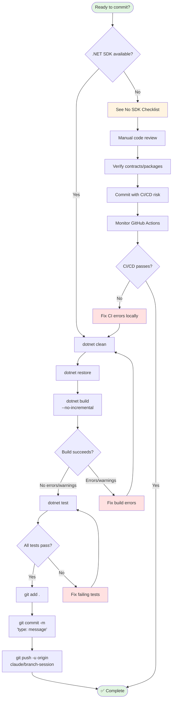

# Pre-Commit Checklist

**⚠️ CRITICAL**: Run BEFORE EVERY commit to prevent CI/CD failures.

**Last Updated**: 2025-11-16

---

## Quick Decision: Do I Have .NET SDK?

```bash
# Check if dotnet is available
dotnet --version
```

- **✅ Shows version 8.0+** → Follow [Standard Checklist](#standard-checklist-net-sdk-available)
- **❌ Command not found** → Follow [No SDK Checklist](#alternative-no-sdk-checklist)

---

## Visual Workflow



---

## Standard Checklist (.NET SDK Available)

### The One-Command Check

```bash
# Run everything at once
dotnet clean && dotnet restore && dotnet build --no-incremental && dotnet test
```

**✅ All steps succeed** → Safe to commit
**❌ ANY step fails** → DO NOT commit, fix errors first

---

### Step 1: Clean Build

```bash
# Clean all build artifacts
dotnet clean

# Restore all NuGet packages
dotnet restore

# Build entire solution (NOT incremental)
dotnet build --no-incremental
```

**Expected Output**:
```
Build succeeded.
    0 Warning(s)
    0 Error(s)

Time Elapsed 00:00:18.04
```

**Verification Checklist**:
- ✅ Build completes with **zero errors**
- ✅ Build completes with **zero warnings** (warnings = future errors)
- ✅ All projects compile successfully
- ✅ No missing dependencies or package errors

**Common Build Errors**:

| Error | Cause | Fix |
|-------|-------|-----|
| "Type X not found" | Missing using statement | Add `using Namespace.Of.Type;` |
| "Namespace mismatch" | Namespace doesn't match folder | Fix namespace to match folder structure |
| "Missing project reference" | Project dependency not added | `dotnet add reference <project>` |
| "Property Y does not exist" | Guessed property name | Read actual class definition |

---

### Step 2: Run ALL Tests

```bash
# Run all tests in solution
dotnet test
```

**Expected Output**:
```
Passed!  - Failed:     0, Passed:    80, Skipped:     0, Total:    80, Duration: 10 s
```

**Verification Checklist**:
- ✅ **ALL tests pass** (zero failures)
- ✅ No tests are skipped unexpectedly
- ✅ Tests run to completion without hanging
- ✅ No test warnings or errors in output

**Common Test Errors**:

| Error | Cause | Fix |
|-------|-------|-----|
| NullReferenceException | Missing mock setup | Add `.Setup()` for all dependencies |
| Mock setup doesn't match | Method signature changed | Update mock to match actual signature |
| Timeout | Slow code or infinite loop | Optimize code or increase timeout |
| Can't find dependencies | Missing project reference | Add reference to test project |

---

### Step 3: Run Validation Scripts (Optional)

```bash
# Run project-specific validation
./test-critical-paths.sh

# Run code validation
./validate-code.sh

# Validate documentation
./docs-validation.sh
```

---

### Step 4: Verify New Files

If you created new files:

```bash
# Check that new files are staged
git status

# Review what will be committed
git diff --staged
```

**Check**:
- ✅ New .cs files are auto-included (SDK-style projects)
- ✅ No unintended files staged (secrets, temp files)
- ✅ All related files included (test + implementation)

---

### Step 5: Check for Common Issues

```bash
# Verify both configurations build
dotnet build -c Debug
dotnet build -c Release

# Check for hardcoded paths (should return nothing)
grep -r "C:\\\\" src/              # Windows paths
grep -r "/Users/" src/             # macOS paths
grep -r "localhost:5000" src/      # Hardcoded URLs
```

---

### Step 6: Final Verification

```bash
# 1. Final clean build
dotnet clean && dotnet restore && dotnet build --no-incremental

# 2. Final test run
dotnet test

# 3. Check status
git status

# 4. Review changes one more time
git diff --staged

# 5. Commit
git commit -m "type: descriptive message"

# 6. Push
git push -u origin claude/your-branch-name
```

---

## Alternative: No SDK Checklist

**When**: .NET SDK not available (Claude Code web, restricted environments)

**⚠️ WARNING**: Cannot verify build/tests locally → Extra careful code review required

### Quick Validation Steps

| Step | Action | Why |
|------|--------|-----|
| 1 | Read ALL type definitions | Don't guess property/method names |
| 2 | Check .csproj package refs | Ensure all packages used are referenced |
| 3 | Review code with `git diff` | Check for syntax errors, logic issues |
| 4 | Verify project references | Ensure .csproj has all needed projects |
| 5 | Check namespaces/using | Verify all using statements correct |
| 6 | Document CI/CD dependency | Note in commit message |
| 7 | Monitor build IMMEDIATELY | Watch GitHub Actions after push |

### Step 1: Verify Contracts Before Use

**⚠️ CRITICAL**: Always read type definitions before using them - don't guess property/method names!

**Before using ANY type (class, interface, enum)**:

1. **Read the definition file** - Don't assume property/method names
2. **Check required vs optional** - Note nullability and `required` keyword
3. **Verify parameter types** - Especially for methods and constructors
4. **Use exact names** - Property names are case-sensitive

**Quick Verification**:
```bash
# Find the type definition
grep -r "class YourType" src/

# Read the complete definition
cat path/to/file.cs

# Use EXACT names from the definition
```

**Common Mistakes**:
```csharp
// ❌ WRONG: Guessing property names
var obj = new SomeModel { Message = "..." };  // Property might not exist!

// ✅ CORRECT: Read class definition first, use actual properties
var obj = new SomeModel { Error = "..." };    // Property verified to exist
```

**Key Rules**:
- Never guess property/method/parameter names
- Always verify nullability (`string?` vs `string`, `required` keyword)
- Check method signatures match when setting up mocks
- Verify enum values exist before using them

### Step 2: Verify Package References

**For NEW test files**:
```bash
# If test code uses BCrypt.Net.BCrypt
# Ensure: <PackageReference Include="BCrypt.Net-Next" Version="4.0.3" />

# If test code uses ILogger<T>
# Ensure: <PackageReference Include="Microsoft.Extensions.Logging.Abstractions" Version="8.0.0" />
```

**Check**: `tests/HotSwap.Distributed.Tests/HotSwap.Distributed.Tests.csproj`

### Step 3: Review All Code Changes

```bash
# Show all changes
git diff

# Review staged changes
git diff --cached
```

**Check for**:
- ✅ All `using` statements are correct
- ✅ All types exist in referenced projects/packages
- ✅ No syntax errors (semicolons, braces, etc.)
- ✅ Proper async/await usage
- ✅ Mock setups match actual method signatures
- ✅ FluentAssertions syntax correct

### Step 4: Commit with CI/CD Note

```bash
git commit -m "feat: your feature description

Note: Build and tests will run in GitHub Actions CI/CD pipeline.
Package references verified manually (no local .NET SDK available).
"
```

### Step 5: Monitor CI/CD Immediately

```bash
# Push to remote
git push -u origin claude/your-branch-name

# IMMEDIATELY check build status
# GitHub: https://github.com/scrawlsbenches/Claude-code-test/actions
```

**If build fails**:
1. Read error message in GitHub Actions logs
2. Fix locally using this checklist
3. Commit fix: `git commit -m "fix: resolve build error from CI/CD"`
4. Push and monitor again

---

## What NOT to Commit

**❌ NEVER commit if**:
- Build has errors or warnings (if SDK available)
- Any tests are failing (if SDK available)
- You didn't verify contracts (if SDK NOT available)
- Code contains `// TODO: Fix this before commit`
- Code contains hardcoded secrets or environment values
- You changed interfaces without updating implementations
- Test project missing package references

---

## Emergency Fixes (If You Committed Too Early)

```bash
# If CI/CD fails after push:

# 1. Pull the latest
git pull origin claude/your-branch

# 2. Fix the issues locally
dotnet clean && dotnet restore && dotnet build --no-incremental && dotnet test

# 3. Make fixes...

# 4. Commit the fix
git add .
git commit -m "fix: resolve build/test failures from CI/CD"

# 5. Push again
git push -u origin claude/your-branch
```

---

## The Golden Rule

**BUILD + TEST = SUCCESS**

```bash
# ALWAYS run this before committing (if SDK available):
dotnet clean && \
dotnet restore && \
dotnet build --no-incremental && \
dotnet test

# If ALL steps succeed → Safe to commit
# If ANY step fails → DO NOT commit until fixed
```

---

## See Also

- [TDD Workflow](tdd-workflow.md) - Test-Driven Development process
- [Git Workflow](git-workflow.md) - Git conventions and branch naming
- [Task Management](task-management.md) - Using TASK_LIST.md

**Back to**: [Main CLAUDE.md](../CLAUDE.md#critical-pre-commit-checklist)
