# Test-Driven Development (TDD) Workflow

**Status**: ⚠️ **MANDATORY** - All code changes MUST follow TDD

**Last Updated**: 2025-11-16

---

## Why TDD is Mandatory

1. **Prevents regressions** - Tests catch breaking changes immediately
2. **Improves design** - Writing tests first leads to better API design
3. **Documents behavior** - Tests serve as living documentation
4. **Reduces debugging time** - Issues caught during development, not in CI/CD
5. **Ensures testability** - Code is designed to be testable from the start

---

## The Red-Green-Refactor Cycle

```
🔴 RED → 🟢 GREEN → 🔵 REFACTOR
```

1. **🔴 RED** - Write a failing test that defines desired behavior
2. **🟢 GREEN** - Write minimal code to make the test pass
3. **🔵 REFACTOR** - Improve code quality while keeping tests green

---

## Visual Workflow

```mermaid
flowchart TD
    Start([New feature or bug?]) --> Type{Feature or Bug?}

    Type -->|Feature| Red1[🔴 RED: Write failing test<br/>for new behavior]
    Type -->|Bug| Red2[🔴 RED: Write test that<br/>reproduces bug]

    Red1 --> RunRed[Run: dotnet test --filter TestName]
    Red2 --> RunRed

    RunRed --> Fails{Test fails?}
    Fails -->|Yes ✅| Green[🟢 GREEN: Write minimal<br/>code to pass test]
    Fails -->|No ❌| FixTest[Fix test - it should fail!<br/>Test is wrong if it passes]
    FixTest --> RunRed

    Green --> RunGreen[Run: dotnet test --filter TestName]
    RunGreen --> Passes{Test passes?}

    Passes -->|Yes ✅| Refactor[🔵 REFACTOR: Improve code<br/>quality, add docs]
    Passes -->|No ❌| FixImpl[Fix implementation]
    FixImpl --> RunGreen

    Refactor --> RunAll[Run ALL tests:<br/>dotnet test]
    RunAll --> AllPass{All tests pass?}

    AllPass -->|Yes ✅| More{More test cases?}
    AllPass -->|No ❌| Revert[Revert refactor,<br/>keep tests green]
    Revert --> RunAll

    More -->|Yes| Red1
    More -->|No| Commit[Commit with tests ✅]
    Commit --> Done([✅ Feature complete])

    style Start fill:#e1f5e1
    style Done fill:#e1f5e1
    style Red1 fill:#ffe1e1
    style Red2 fill:#ffe1e1
    style Green fill:#e1ffe1
    style Refactor fill:#e1e1ff
    style FixTest fill:#fff4e1
    style FixImpl fill:#fff4e1
    style Revert fill:#fff4e1
```



---

## TDD Workflow for New Features

### Step 1: 🔴 RED - Write Failing Test

```bash
# Navigate to tests directory
cd tests/HotSwap.Distributed.Tests/

# Create or edit test file (e.g., UserAuthenticationTests.cs)
```

**Write test that defines expected behavior**:

```csharp
[Fact]
public async Task AuthenticateAsync_WithValidCredentials_ReturnsToken()
{
    // Arrange
    var mockRepo = new Mock<IUserRepository>();
    var service = new AuthenticationService(mockRepo.Object);

    mockRepo.Setup(x => x.GetUserAsync("testuser", It.IsAny<CancellationToken>()))
        .ReturnsAsync(new User { Username = "testuser", PasswordHash = "hash" });

    // Act
    var result = await service.AuthenticateAsync("testuser", "password");

    // Assert
    result.Should().NotBeNull();
    result.Token.Should().NotBeEmpty();
}
```

### Step 2: Run Test - It Should FAIL (RED)

```bash
dotnet test --filter "FullyQualifiedName~AuthenticateAsync_WithValidCredentials"
```

**Expected**: Test FAILS (because implementation doesn't exist yet)

**If test passes** → Test is wrong, fix the test!

### Step 3: 🟢 GREEN - Implement Minimal Code

```bash
# Create or edit implementation file
# src/HotSwap.Distributed.Api/Services/AuthenticationService.cs
```

**Write ONLY enough code to make test pass**:

```csharp
public class AuthenticationService : IAuthenticationService
{
    private readonly IUserRepository _repository;

    public AuthenticationService(IUserRepository repository)
    {
        _repository = repository;
    }

    public async Task<AuthToken> AuthenticateAsync(string username, string password, CancellationToken cancellationToken = default)
    {
        var user = await _repository.GetUserAsync(username, cancellationToken);
        // Minimal implementation - just make test pass
        return new AuthToken { Token = Guid.NewGuid().ToString() };
    }
}
```

### Step 4: Run Test - It Should PASS (GREEN)

```bash
dotnet test --filter "FullyQualifiedName~AuthenticateAsync_WithValidCredentials"
```

**Expected**: Test PASSES

**If test still fails** → Fix implementation, not the test

### Step 5: 🔵 REFACTOR - Improve Code Quality

Now improve the implementation while keeping tests green:

```csharp
public async Task<AuthToken> AuthenticateAsync(string username, string password, CancellationToken cancellationToken = default)
{
    // Validate input
    ArgumentException.ThrowIfNullOrWhiteSpace(username);
    ArgumentException.ThrowIfNullOrWhiteSpace(password);

    // Get user
    var user = await _repository.GetUserAsync(username, cancellationToken);
    if (user == null)
    {
        throw new AuthenticationException("Invalid credentials");
    }

    // Verify password
    if (!BCrypt.Net.BCrypt.Verify(password, user.PasswordHash))
    {
        throw new AuthenticationException("Invalid credentials");
    }

    // Generate token
    var token = _tokenGenerator.GenerateToken(user);

    _logger.LogInformation("User {Username} authenticated successfully", username);

    return new AuthToken { Token = token, ExpiresAt = DateTime.UtcNow.AddHours(1) };
}
```

### Step 6: Run ALL Tests

```bash
dotnet test
```

**Expected**: All tests pass

**If any test fails** → Refactoring broke something, revert and try smaller steps

### Step 7: Repeat for Edge Cases

Add tests for:
- Invalid credentials
- Null/empty input
- Non-existent user
- Error handling

```csharp
[Fact]
public async Task AuthenticateAsync_WithNullUsername_ThrowsArgumentException()
{
    // Arrange
    var service = new AuthenticationService(_mockRepo.Object);

    // Act
    Func<Task> act = async () => await service.AuthenticateAsync(null, "password");

    // Assert
    await act.Should().ThrowAsync<ArgumentException>();
}
```

---

## TDD Workflow for Bug Fixes

### Step 1: 🔴 RED - Reproduce the Bug

Write a test that demonstrates the bug:

```csharp
[Fact]
public async Task ProcessDeployment_WhenCancelled_ShouldCleanupResources()
{
    // This test fails because bug exists
    // Arrange
    var cts = new CancellationTokenSource();
    cts.Cancel();

    // Act
    await _orchestrator.ProcessDeploymentAsync(request, cts.Token);

    // Assert
    _mockResourceManager.Verify(x => x.CleanupAsync(It.IsAny<string>()), Times.Once);
}
```

### Step 2: Run Test - Verify It FAILS

```bash
dotnet test --filter "ProcessDeployment_WhenCancelled"
```

**Expected**: Test FAILS (confirms bug exists)

### Step 3: 🟢 GREEN - Fix the Bug

Make minimal changes to pass the test:

```csharp
public async Task ProcessDeploymentAsync(DeploymentRequest request, CancellationToken cancellationToken)
{
    try
    {
        // ... deployment logic ...
    }
    catch (OperationCanceledException)
    {
        // BUG FIX: Cleanup resources on cancellation
        await _resourceManager.CleanupAsync(request.DeploymentId);
        throw;
    }
}
```

### Step 4: Run Test - Verify It PASSES

```bash
dotnet test --filter "ProcessDeployment_WhenCancelled"
```

### Step 5: 🔵 REFACTOR - Clean Up

Improve the fix if needed, run all tests to verify.

---

## TDD Workflow for Refactoring

### Step 1: Verify Tests Exist

```bash
dotnet test --filter "FullyQualifiedName~ClassYouWantToRefactor"
```

**If no tests exist** → STOP and write tests first (follow "New Feature" workflow)

### Step 2: 🔵 REFACTOR - Change Internal Structure

Keep behavior identical, only change structure:

```csharp
// Before: Long method
public async Task<Result> ProcessAsync(Request request)
{
    // 100 lines of code...
}

// After: Extracted methods
public async Task<Result> ProcessAsync(Request request)
{
    ValidateRequest(request);
    var data = await FetchDataAsync(request);
    var processed = ProcessData(data);
    return CreateResult(processed);
}
```

### Step 3: Run Tests Continuously

```bash
# Run after each small refactoring step
dotnet test
```

**Tests should ALWAYS pass** - if they fail, revert and try smaller steps

### Step 4: Verify All Tests Still Pass

```bash
dotnet test
```

**All tests green** → Refactoring successful
**Any test red** → Revert refactoring

---

## Best Practices

### Test Naming Convention

**Format**: `MethodName_StateUnderTest_ExpectedBehavior`

**Examples**:
- ✅ `CreateDeployment_WithInvalidRequest_ReturnsBadRequest`
- ✅ `AuthenticateAsync_WithValidCredentials_ReturnsToken`
- ❌ `TestAuthentication` (too vague)
- ❌ `Test1` (meaningless)

### AAA Pattern (Arrange-Act-Assert)

```csharp
[Fact]
public async Task MethodName_StateUnderTest_ExpectedBehavior()
{
    // Arrange - Set up test data and mocks
    var mockDependency = new Mock<IDependency>();
    var sut = new SystemUnderTest(mockDependency.Object);

    // Act - Execute the method being tested
    var result = await sut.MethodAsync(parameters);

    // Assert - Verify expected behavior using FluentAssertions
    result.Should().NotBeNull();
    result.Property.Should().Be(expectedValue);
}
```

### Mock Setup Patterns

```csharp
// ✅ CORRECT: Mock setup matches actual method signature
mockRepo.Setup(x => x.GetAsync(It.IsAny<string>(), It.IsAny<CancellationToken>()))
    .ReturnsAsync(expectedResult);

// ❌ WRONG: Mock setup doesn't match signature
mockRepo.Setup(x => x.GetAsync(It.IsAny<string>()))  // Missing CancellationToken!
    .ReturnsAsync(expectedResult);
```

### Assertion Patterns (FluentAssertions)

```csharp
// ✅ Use FluentAssertions for readable assertions
result.Should().NotBeNull();
result.Items.Should().HaveCount(5);
result.Name.Should().Be("Expected Name");
result.Status.Should().Be(DeploymentStatus.Running);

// ❌ Avoid xUnit Assert (less readable)
Assert.NotNull(result);
Assert.Equal(5, result.Items.Count);
```

### Test Coverage Requirements

**Happy path** - Normal successful execution:
```csharp
[Fact]
public async Task CreateUser_WithValidData_ReturnsCreatedUser()
```

**Edge cases** - Boundary conditions:
```csharp
[Theory]
[InlineData("")]
[InlineData("   ")]
[InlineData(null)]
public async Task CreateUser_WithInvalidUsername_ThrowsArgumentException(string username)
```

**Error cases** - Exceptions, failures:
```csharp
[Fact]
public async Task CreateUser_WhenDatabaseFails_ThrowsInfrastructureException()
```

---

## TDD Checklist

Before marking any coding task complete:

- ✅ Tests were written BEFORE implementation
- ✅ Tests initially FAILED (RED)
- ✅ Implementation makes tests PASS (GREEN)
- ✅ Code was REFACTORED for quality (BLUE)
- ✅ ALL tests pass (`dotnet test` shows zero failures)
- ✅ Test coverage includes happy path, edge cases, and error cases
- ✅ Tests use AAA pattern (Arrange-Act-Assert)
- ✅ Tests use FluentAssertions for readable assertions
- ✅ Mock setups match actual method signatures
- ✅ Test naming follows `MethodName_StateUnderTest_ExpectedBehavior`

**If you cannot answer YES to all items → Task is NOT complete**

---

## When to Skip TDD

**NEVER**. TDD is mandatory for all code changes.

Even for:
- "Quick fixes" - Write test first to verify the fix
- "Simple changes" - Tests prevent future regressions
- "Documentation updates" - Docs changes don't need tests, but code does
- "Refactoring" - Existing tests must pass, add tests if missing

---

## Common TDD Mistakes

| Mistake | Problem | Solution |
|---------|---------|----------|
| Writing tests after implementation | Not true TDD, misses design benefits | Write tests FIRST, always |
| Test passes without implementation | Test is wrong | Fix test to actually test the behavior |
| Skipping refactor step | Technical debt accumulates | Always refactor after green |
| Testing implementation details | Brittle tests | Test behavior, not implementation |
| Not running all tests | Breaks existing code | Always `dotnet test` after refactor |
| Committing failing tests | Breaks CI/CD | Never commit red tests |

---

## Example: Complete TDD Session

**Task**: Add rate limiting to API

```bash
# 1️⃣ 🔴 RED - Write failing test
[Fact]
public async Task InvokeAsync_WhenRateLimitExceeded_ReturnsStatus429()
{
    // Test for rate limiting behavior
}

# Run: dotnet test --filter "InvokeAsync_WhenRateLimitExceeded"
# Expected: FAILS

# 2️⃣ 🟢 GREEN - Implement minimal code
public class RateLimitingMiddleware
{
    public async Task InvokeAsync(HttpContext context)
    {
        // Minimal implementation to pass test
    }
}

# Run: dotnet test --filter "InvokeAsync_WhenRateLimitExceeded"
# Expected: PASSES

# 3️⃣ 🔵 REFACTOR - Improve implementation
- Add sliding window algorithm
- Add configuration
- Add logging
- Add XML documentation

# Run: dotnet test
# Expected: All tests pass

# 4️⃣ Add more test cases (repeat cycle)
- Test rate limit reset
- Test different endpoints
- Test concurrent requests
- Test configuration options

# 5️⃣ Commit when all tests green
git add .
git commit -m "feat: add rate limiting middleware with configurable limits"
git push
```

---

## See Also

- [Pre-Commit Checklist](pre-commit-checklist.md) - Verify before committing
- [Code Templates](../templates/test-template.cs) - Test template with AAA pattern
- [Testing Requirements](../CLAUDE.md#testing-requirements) - Full testing standards

**Advanced Patterns**: See [Appendix D: TDD Patterns](../appendices/D-TDD-PATTERNS.md) (coming soon)

**Back to**: [Main CLAUDE.md](../CLAUDE.md#test-driven-development-tdd-workflow)
